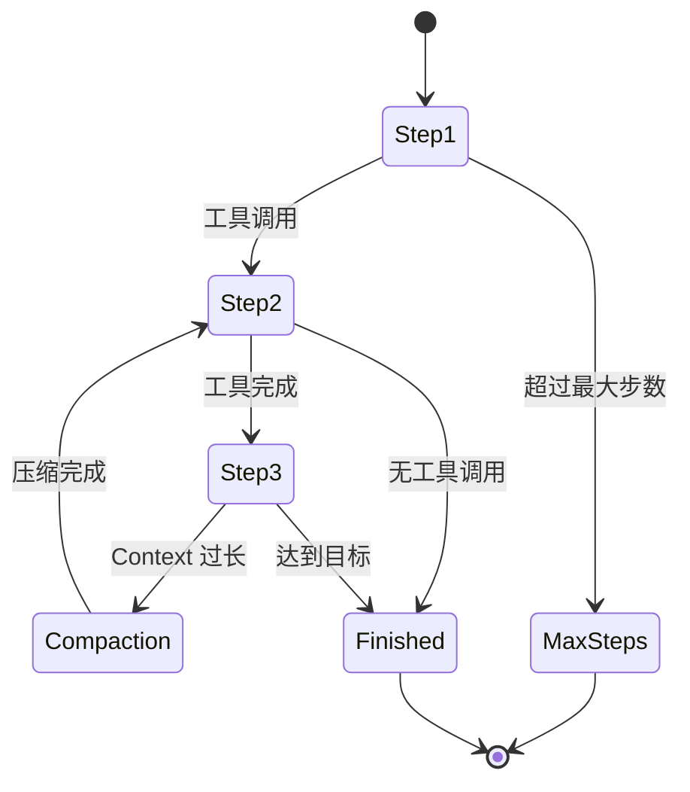

# 项目优雅设计总结 🎯

## 📋 文档清单

本次分析共创建了 **8 个分模块总结文档**，全面覆盖了 Kimi CLI 的核心架构和设计优雅之处：

| 序号 | 文档名称 | 内容概要 |
|------|----------|----------|
| 01 | [Wire 模块](./01_wire模块.md) | 核心通信机制，三层架构设计 |
| 02 | [Soul 模块](./02_soul模块.md) | AI Agent 核心引擎，Protocol 驱动 |
| 03 | [UI 模块](./03_ui模块.md) | 多层用户界面，Compose 架构 |
| 04 | [Tools 模块](./04_tools模块.md) | 工具系统与扩展机制 |
| 05 | [Utils 模块](./05_utils模块.md) | 基础工具库，跨平台支持 |
| 06 | [根目录文件](./06_根目录文件.md) | 应用入口与核心组件 |
| 07 | [静态资源目录](./07_静态资源目录.md) | 配置与提示词库 |
| 08 | [模块接口与依赖关系](./08_模块接口与依赖关系.md) | 解耦架构的通信桥梁 |

---

## 🏆 核心设计原则

### 1. Protocol 驱动设计

**定义**: 使用 Protocol（接口）而非抽象基类定义组件契约

**应用模块**:
- **Wire 模块**: `WireMessage` Protocol 定义消息契约
- **Soul 模块**: `Soul` Protocol 定义 AI Agent 接口
- **Tools 模块**: `CallableTool2` Protocol 定义工具接口
- **UI 模块**: `BaseUI` Protocol 定义 UI 接口

**优雅之处**:
- ✅ **鸭子类型**: 任何实现了接口的类都符合契约
- ✅ **无需继承**: 保持实现类的灵活性
- ✅ **运行时检查**: `@runtime_checkable` 支持 `isinstance()` 检查
- ✅ **类型安全**: 完整的类型注解和泛型支持
- ✅ **IDE 友好**: 自动补全和类型检查

**代码示例**:
```python
@runtime_checkable
class Soul(Protocol):
    @property
    def name(self) -> str: ...
    @property
    def status(self) -> StatusSnapshot: ...
    async def run(self, user_input: str): ...

class KimiSoul(Soul):  # 实现了 Soul Protocol
    ...
```

### 2. 分层架构设计

**定义**: 将系统划分为多个层次，每层职责单一，层与层之间通过接口交互

**架构层次**:
```
┌─────────────────────────────────────────┐
│           UI 层（用户交互）              │
├─────────────────────────────────────────┤
│           Wire 层（通信机制）            │
├─────────────────────────────────────────┤
│          Soul 层（AI 引擎）              │
├─────────────────────────────────────────┤
│         Tools 层（工具扩展）             │
├─────────────────────────────────────────┤
│         Utils 层（基础工具）             │
└─────────────────────────────────────────┘
```

**优雅之处**:
- ✅ **职责清晰**: 每层只负责特定功能
- ✅ **松耦合**: 层与层之间依赖最小化
- ✅ **易于测试**: 可以分层测试和 mock
- ✅ **可维护**: 修改一层不影响其他层
- ✅ **可扩展**: 新功能可以添加到特定层

### 3. 工厂模式与依赖注入

**定义**: 使用工厂函数创建复杂对象，使用依赖注入解耦依赖关系

**应用场景**:
- **Soul 模块**: `create_soul()` 工厂函数创建 KimiSoul 实例
- **UI 模块**: `MyCLI._create_ui()` 工厂方法创建 UI
- **LLM 模块**: `create_llm()` 工厂函数创建不同 Provider 的 LLM
- **Tools 模块**: `load_agent()` 自动注入工具依赖

**优雅之处**:
- ✅ **创建解耦**: 创建逻辑与使用逻辑分离
- ✅ **易于扩展**: 新增类型只需扩展工厂
- ✅ **测试友好**: 可以 mock 工厂函数
- ✅ **配置驱动**: 根据配置选择创建对象
- ✅ **自动注入**: 使用 `inspect.signature` 自动匹配依赖

**代码示例**:
```python
async def create_soul(...) -> KimiSoul:
    # 1. 创建依赖
    config = load_config(...)
    llm = create_llm(...)
    runtime = Runtime(...)

    # 2. 依赖注入
    agent = await load_agent(DEFAULT_AGENT_FILE, runtime)

    # 3. 创建并返回
    return KimiSoul(agent, runtime, context=context)
```

### 4. Compose 架构（vs 累积架构）

**定义**: 每次渲染都重新组合所有组件，而非累积式修改

**对比**:
```python
# ❌ 累积架构（旧）
class OldVisualize:
    def __init__(self):
        self.text = Text()  # 累积式

    def on_text(self, text):
        self.text.append(text)  # 只能累积，无法清除

    def render(self):
        console.print(self.text)  # 旧内容还在

# ✅ Compose 架构（新）
class NewVisualize:
    def compose(self):
        return Group(
            self._content_block.compose(),
            self._status_block.compose(),
            # 每次都重新组合！
        )
```

**优雅之处**:
- ✅ **无状态冲突**: 每次都重新组合，没有状态残留
- ✅ **无重复显示**: 流式参数不会重复显示
- ✅ **条件渲染**: 只渲染有内容的 Block
- ✅ **易于维护**: Block 职责单一，代码清晰
- ✅ **状态驱动**: 根据当前状态组合不同渲染

### 5. 异步优先设计

**定义**: 全程异步，避免阻塞，充分利用 asyncio

**应用场景**:
- **Wire 机制**: 使用 `asyncio.Queue` 实现异步消息传递
- **工具执行**: 所有工具都是异步函数
- **UI 渲染**: 实时渲染和键盘监听都是异步
- **网络请求**: HTTP 客户端使用 aiohttp
- **文件 I/O**: 使用异步文件操作

**优雅之处**:
- ✅ **高性能**: 不会阻塞主线程
- ✅ **并发友好**: 可以同时执行多个操作
- ✅ **资源高效**: 使用异步 I/O
- ✅ **实时响应**: UI 可以实时响应用户输入
- ✅ **可扩展**: 容易扩展为流式处理

### 6. 配置驱动架构

**定义**: 通过配置文件控制所有行为，无需修改代码

**配置层次**:
```
配置文件 (config.json)
    ↓
Agent 规范 (agent.yaml)
    ↓
系统提示词 (system.md)
    ↓
工具描述 (tool.md)
```

**优雅之处**:
- ✅ **灵活性**: 无需修改代码即可改变行为
- ✅ **多环境**: 开发/测试/生产使用不同配置
- ✅ **用户友好**: 用户可以轻松配置
- ✅ **安全性**: 敏感信息通过配置文件管理
- ✅ **版本控制**: 配置变更可以版本化

### 7. 错误处理分层

**定义**: 不同层处理不同类型的异常，提供不同的用户体验

**异常层次**:
```python
# CLI 层：捕获所有异常，返回退出码
try:
    my_cli_app = MyCLI(...)
    return asyncio.run(my_cli_app.run(command))
except KeyboardInterrupt:
    return 130  # 标准退出码
except Exception as e:
    logger.exception("Unexpected error")
    return 1

# 应用层：处理业务异常
try:
    soul = await create_soul(...)
except LLMNotSet:
    console.print("[red]LLM 未配置[/red]")
    return 1

# 模块内部：抛出语义化异常
def load_config(...):
    if not config_file.exists():
        raise ConfigError(f"Config file not found: {config_file}")
```

**优雅之处**:
- ✅ **精准处理**: 不同层处理不同类型的错误
- ✅ **用户友好**: 向用户显示友好的错误信息
- ✅ **调试友好**: 记录详细的错误日志
- ✅ **标准退出**: 正确返回退出码
- ✅ **不中断**: 非致命错误不中断程序

---

## 🎨 架构亮点

### 三层通信架构

```
┌──────────────────────────────────────────┐
│           Application Layer              │
│  ┌──────────┐ ┌──────────┐ ┌──────────┐│
│  │ Shell UI │ │ Print UI │ │  ACP UI  ││
│  └────┬─────┘ └────┬─────┘ └────┬─────┘│
└───────┼────────────┼────────────┼──────┘
        │            │            │
        └────────────┼────────────┘
                     ↓
┌──────────────────────────────────────────┐
│        Wire Messaging Layer              │
│  ┌────────────────────────────────────┐ │
│  │       Wire Queue (asyncio.Queue)   │ │
│  │                                     │ │
│  │  WireSoulSide ←→ Queue ←→ WireUISide│ │
│  │   (Producer)           (Consumer)   │ │
│  └────────────────────────────────────┘ │
└────────────────┬────────────────────────┘
                 ↓
┌──────────────────────────────────────────┐
│            Soul Layer                    │
│  ┌──────────┐ ┌──────────┐ ┌──────────┐│
│  │  Agent   │ │ Runtime  │ │ Context  ││
│  └──────────┘ └──────────┘ └──────────┘│
└──────────────────────────────────────────┘
```

**优雅之处**:
- ✅ **彻底解耦**: UI 和 Soul 完全独立
- ✅ **真正流式**: 异步消息队列实现流式输出
- ✅ **易于扩展**: Protocol + 类型系统 + 简单接口
- ✅ **健壮性**: 错误处理 + 优雅退出 + 资源清理

### Agent 循环状态机



**优雅之处**:
- ✅ **状态清晰**: 每一步都有明确的状态转换
- ✅ **可扩展**: 易于添加新的状态转换
- ✅ **健壮性**: 处理各种异常情况（取消、错误、时空穿越）

### 工具系统架构

```mermaid
graph TB
    A[LLM 决定调用工具] --> B[Toolset.handle()]
    B --> C[查找工具实例]
    C --> D[异步执行工具]
    D --> E[返回 ToolResult]
    E --> F[Wire 发送给 UI]
    F --> G[用户批准/拒绝]
    G --> H[工具执行/拒绝]
```

**优雅之处**:
- ✅ **协议驱动**: 使用 Protocol 定义工具接口
- ✅ **类型安全**: 泛型 + Pydantic 提供完整类型安全
- ✅ **模块化**: 按功能分类，易于维护和扩展
- ✅ **安全机制**: 批准机制 + 路径遍历检查
- ✅ **输出控制**: 自动截断 + Builder 模式

---

## 📊 数据统计

### 代码量分布

| 模块 | 主要文件数 | 核心特性 |
|------|-----------|----------|
| **Wire** | 2 个文件 | 异步消息队列，ContextVar |
| **Soul** | 10 个文件 | Protocol 驱动，依赖注入，状态机 |
| **UI** | 10 个文件 | Compose 架构，分层设计 |
| **Tools** | 20+ 个文件 | 工具协议，批准机制 |
| **Utils** | 12 个文件 | 跨平台，异步优先 |
| **根目录** | 11 个文件 | 工厂模式，配置驱动 |
| **静态资源** | 配置文件 | 声明式配置 |

### 设计模式使用

| 设计模式 | 应用模块 | 使用次数 |
|----------|----------|----------|
| **Protocol** | 全局 | 5+ |
| **Factory** | Soul/UI/LLM | 3+ |
| **Builder** | Tools/Utils | 2+ |
| **Decorator** | UI/Metacmd | 2+ |
| **Template** | Tools/Prompts | 2+ |
| **Adapter** | Tools/MCP | 1 |
| **Singleton** | Utils/Console | 1 |
| **Observer** | Wire/UI | 1 |

---

## 🚀 学习价值

### 对开发者的启发

1. **架构思维**: 学习如何设计清晰的分层架构
2. **设计模式**: 掌握多种设计模式的实际应用
3. **异步编程**: 深入理解 asyncio 的使用技巧
4. **类型系统**: 充分利用 Python 的类型系统
5. **协议设计**: 使用 Protocol 而非继承
6. **配置管理**: 设计灵活的配置系统
7. **错误处理**: 分层处理不同类型的异常
8. **代码组织**: 保持代码的模块化和可维护性

### 最佳实践

1. ✅ **优先使用 Protocol**: 定义接口而非继承抽象类
2. ✅ **工厂模式解耦创建**: 统一创建对象，易于扩展
3. ✅ **异步优先**: 充分利用 asyncio 提升性能
4. ✅ **配置驱动**: 通过配置文件控制行为
5. ✅ **类型安全**: 完整的类型注解和验证
6. ✅ **错误分层**: 不同层处理不同异常
7. ✅ **文档友好**: 代码即文档，自文档化
8. ✅ **测试友好**: 设计时考虑可测试性

---

## 📚 延伸阅读

### 相关文档

- [Wire 模块详解](./01_wire模块.md) - 了解三层通信架构
- [Soul 模块详解](./02_soul模块.md) - 学习 Protocol 驱动设计
- [UI 模块详解](./03_ui模块.md) - 掌握 Compose 架构
- [Tools 模块详解](./04_tools模块.md) - 深入工具系统设计
- [Utils 模块详解](./05_utils模块.md) - 基础工具库设计
- [根目录文件详解](./06_根目录文件.md) - 应用架构设计
- [静态资源目录详解](./07_静态资源目录.md) - 配置与内容管理
- [模块接口与依赖关系详解](./08_模块接口与依赖关系.md) - 解耦架构通信指南

### 核心技术

- **asyncio**: Python 异步编程标准库
- **Protocol**: 类型提示中的结构化协议
- **Pydantic**: 数据验证和设置管理
- **Rich**: 终端美化和渲染
- **Typer**: 现代命令行框架
- **loguru**: Python 日志库

---

## 🎯 总结

Kimi CLI 项目展示了如何设计一个**优雅、可维护、可扩展**的 Python 应用系统。其核心优雅设计体现在：

### 架构层面
- ✅ **分层清晰**: UI/Wire/Soul/Tools/Utils 分层明确
- ✅ **解耦彻底**: 通过 Protocol 和工厂模式实现松耦合
- ✅ **通信优雅**: Wire 机制实现真正解耦的异步通信
- ✅ **状态管理**: 清晰的状态机和上下文管理

### 设计层面
- ✅ **Protocol 驱动**: 优先使用 Protocol 而非继承
- ✅ **Compose 架构**: 重新组合优于累积式修改
- ✅ **依赖注入**: 自动注入减少样板代码
- ✅ **配置驱动**: 配置文件控制所有行为

### 实现层面
- ✅ **异步优先**: 全程异步，性能优异
- ✅ **类型安全**: 完整类型注解和验证
- ✅ **错误处理**: 分层处理不同类型异常
- ✅ **跨平台**: 自动适配不同操作系统

### 维护层面
- ✅ **模块化**: 每个模块职责单一
- ✅ **可测试**: 设计时考虑可测试性
- ✅ **可扩展**: 新功能可以轻松添加
- ✅ **文档友好**: 代码即文档，自文档化

这个项目是学习**现代 Python 应用架构设计**的优秀范例，值得深入研究和参考。

---

**创建时间**: 2025-11-22
**基于文档**: docs/分模块总结/*.md
**分析范围**: my_cli/ 目录下的所有核心模块
