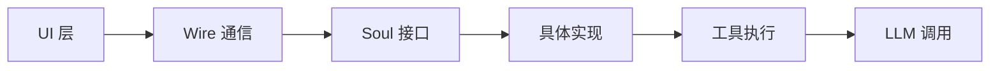

# Soul 模块 - AI Agent 核心引擎 🧠

## 🎯 模块概览

Soul 模块是 Kimi CLI 的**AI 大脑核心**，只负责定义 AI Agent 的接口规范。它采用**Protocol 驱动设计**，通过简洁的接口定义实现完全解耦，为上层提供统一的 AI Agent 契约。这是整个系统中最精简的模块，体现了**KISS 原则**的精髓。

---

## 📂 模块文件结构

```
my_cli/soul/
└── __init__.py              # 核心接口 + Wire 机制（仅此文件）
```

**设计理念**: 极简主义 - 只需一个文件！

---

## 🏗️ 架构设计

### 核心设计原则



### 职责划分

| 层次 | 职责 | 内容 |
|------|------|------|
| **接口层** | 定义契约 | Soul Protocol + 异常类 |
| **通信层** | Wire 机制 | run_soul() + wire_send() |
| **实现层** | 具体 Agent | 独立模块实现（不在本目录） |

---

## 📄 文件详解

### `__init__.py` - 核心接口与 Wire 机制

#### 1. 异常类定义

**LLM 未设置异常**:

```python
class LLMNotSet(Exception):
    """当 LLM 未设置时抛出的异常"""
    pass
```

**优雅之处**:
- ✅ 语义清晰 - 一看就懂什么错误
- ✅ 类型安全 - 专门捕获此类异常
- ✅ 用户友好 - 清晰的错误提示

**LLM 不支持异常**:

```python
class LLMNotSupported(Exception):
    """当 LLM 不支持所需能力时抛出的异常"""

    def __init__(self, llm: LLM, capabilities: list[ModelCapability]):
        self.llm = llm
        self.capabilities = capabilities
        capabilities_str = "capability" if len(capabilities) == 1 else "capabilities"
        super().__init__(
            f"LLM 模型 '{llm.model_name}' 不支持所需 {capabilities_str}: "
            f"{', '.join(capabilities)}."
        )
```

**优雅之处**:
- ✅ 详细错误信息 - 包含模型名和缺失的能力
- ✅ 动态提示 - 根据能力数量调整措辞
- ✅ 结构化存储 - 同时存储 llm 和 capabilities 便于调试

**最大步骤数异常**:

```python
class MaxStepsReached(Exception):
    """当达到最大步骤数时抛出的异常"""

    n_steps: int
    """已执行的步数"""

    def __init__(self, n_steps: int):
        self.n_steps = n_steps
```

**优雅之处**:
- ✅ 数据类存储 - 使用 dataclass 简化代码
- ✅ 便于统计 - 存储执行的步数用于分析

#### 2. 状态快照

```python
@dataclass(frozen=True, slots=True)
class StatusSnapshot:
    context_usage: float
    """上下文使用率，单位为百分比"""
```

**优雅之处**:
- ✅ **不可变对象** - 使用 `frozen=True` 防止修改
- ✅ **内存优化** - 使用 `slots=True` 减少内存占用
- ✅ **类型明确** - 清楚标明这是百分比

#### 3. Soul Protocol 核心接口

```python
@runtime_checkable
class Soul(Protocol):
    """AI Agent 核心协议"""

    @property
    def name(self) -> str:
        """Agent 的名称"""

    @property
    def model_name(self) -> str:
        """Agent 使用的 LLM 模型名称。空字符串表示未配置 LLM"""

    @property
    def model_capabilities(self) -> set[ModelCapability] | None:
        """Agent 使用的 LLM 模型能力。None 表示未配置 LLM"""

    @property
    def status(self) -> StatusSnapshot:
        """Agent 的当前状态。返回值为不可变对象"""

    async def run(self, user_input: str | list[ContentPart]):
        """
        运行 Agent，处理用户输入直到达到最大步骤数或无更多工具调用

        参数:
            user_input (str | list[ContentPart]): 用户的输入

        抛出异常:
            LLMNotSet: 当 LLM 未设置时
            LLMNotSupported: 当 LLM 不支持所需能力时
            ChatProviderError: 当 LLM 提供商返回错误时
            MaxStepsReached: 当达到最大步骤数时
            asyncio.CancelledError: 当用户取消运行时
        """
        ...
```

**优雅之处**:
1. **Protocol 驱动**:
   - ✅ 鸭子类型 - 任何实现了接口的类都是 `Soul`
   - ✅ 无需继承 - 保持实现类的灵活性
   - ✅ 运行时检查 - `@runtime_checkable` 支持 `isinstance()` 检查
   - ✅ 类型安全 - 完整的类型注解和泛型支持
   - ✅ IDE 友好 - 自动补全和类型检查

2. **属性设计**:
   - ✅ 只读属性 - 防止外部修改内部状态
   - ✅ 状态快照 - 不可变对象保证线程安全
   - ✅ 能力查询 - 动态获取 LLM 能力

3. **异步接口**:
   - ✅ 非阻塞 - 不会阻塞主线程
   - ✅ 流式支持 - 支持流式输出
   - ✅ 取消支持 - 用户可以随时取消

#### 4. UI Loop 函数类型

```python
type UILoopFn = Callable[[WireUISide], Coroutine[Any, Any, None]]
"""用于可视化 Agent 行为的长时间运行的异步函数"""
```

**优雅之处**:
- ✅ **类型别名** - 使用 `type` 定义函数类型
- ✅ **异步优先** - 所有操作都是异步的
- ✅ **灵活性** - 支持任何可视化实现

#### 5. 运行取消异常

```python
class RunCancelled(Exception):
    """当运行被取消事件中止时抛出的异常"""
```

**优雅之处**:
- ✅ **语义明确** - 区分正常完成和被取消
- ✅ **上层感知** - UI 层可以捕获并处理

#### 6. run_soul() 核心函数

```python
async def run_soul(
    soul: Soul,
    user_input: str | list[ContentPart],
    ui_loop_fn: UILoopFn,
    cancel_event: asyncio.Event,
) -> None:
    """
    使用给定的用户输入运行 Agent，通过 Wire 连接到 UI 循环

    `cancel_event` 是用于取消运行的外部句柄。当设置事件时，
    运行将优雅地停止并抛出 `RunCancelled` 异常。

    抛出异常:
        LLMNotSet: 当 LLM 未设置时
        LLMNotSupported: 当 LLM 不支持所需能力时
        ChatProviderError: 当 LLM 提供商返回错误时
        MaxStepsReached: 当达到最大步骤数时
        RunCancelled: 当运行被取消事件中止时
    """
    wire = Wire()
    wire_token = _current_wire.set(wire)

    logger.debug("Starting UI loop with function: {ui_loop_fn}", ui_loop_fn=ui_loop_fn)
    ui_task = asyncio.create_task(ui_loop_fn(wire.ui_side))

    logger.debug("Starting soul run")
    soul_task = asyncio.create_task(soul.run(user_input))

    cancel_event_task = asyncio.create_task(cancel_event.wait())
    await asyncio.wait(
        [soul_task, cancel_event_task],
        return_when=asyncio.FIRST_COMPLETED,
    )

    try:
        if cancel_event.is_set():
            logger.debug("Cancelling the run task")
            soul_task.cancel()
            try:
                await soul_task
            except asyncio.CancelledError:
                raise RunCancelled from None
        else:
            assert soul_task.done()  # either stop event is set or the run task is done
            cancel_event_task.cancel()
            with contextlib.suppress(asyncio.CancelledError):
                await cancel_event_task
            soul_task.result()  # this will raise if any exception was raised in the run task
    finally:
        logger.debug("Shutting down the UI loop")
        # shutting down the wire should break the UI loop
        wire.shutdown()
        try:
            await asyncio.wait_for(ui_task, timeout=0.5)
        except asyncio.QueueShutDown:
            logger.debug("UI loop shut down")
            pass
        except TimeoutError:
            logger.warning("UI loop timed out")
        finally:
            _current_wire.reset(wire_token)
```

**优雅之处**:
1. **三任务协调**:
   - ✅ **UI 任务** - 负责可视化界面
   - ✅ **Soul 任务** - 负责 Agent 执行
   - ✅ **取消任务** - 监听取消事件

2. **ContextVar 模式**:
   ```python
   wire_token = _current_wire.set(wire)  # 设置全局 Wire
   ...
   _current_wire.reset(wire_token)      # 清理全局 Wire
   ```
   - ✅ 线程安全 - 每个任务有独立的 Wire
   - ✅ 自动清理 - finally 块确保资源释放

3. **精确控制**:
   ```python
   await asyncio.wait(
       [soul_task, cancel_event_task],
       return_when=asyncio.FIRST_COMPLETED,
   )
   ```
   - ✅ 等待任意任务完成
   - ✅ 优雅处理取消
   - ✅ 资源清理

4. **错误处理**:
   - ✅ 捕获 `CancelledError` 并转换为 `RunCancelled`
   - ✅ 使用 `assert` 确保逻辑正确
   - ✅ 超时处理防止 UI 任务卡死

#### 7. Wire 通信机制

```python
_current_wire = ContextVar[Wire | None]("current_wire", default=None)
"""当前 Wire 连接的上下文变量"""


def get_wire_or_none() -> Wire | None:
    """
    获取当前 Wire 或 None

    预期在 Agent 循环中的任何地方调用时都不为 None
    """
    return _current_wire.get()


def wire_send(msg: WireMessage) -> None:
    """
    向当前 Wire 发送消息

    将此视为 Soul 的 `print` 和 `input`
    Soul 应该始终使用此函数发送 Wire 消息
    """
    wire = get_wire_or_none()
    assert wire is not None, "Wire is expected to be set when soul is running"
    wire.soul_side.send(msg)
```

**优雅之处**:
1. **ContextVar 设计**:
   - ✅ 线程安全 - 每个协程有独立的 Wire
   - ✅ 自动管理 - 不需要手动传递 Wire
   - ✅ 延迟访问 - 在需要时才获取 Wire

2. **全局函数**:
   - ✅ **简化调用** - 任何地方直接调用 `wire_send()`
   - ✅ **统一接口** - 将 `print` 和 `input` 统一为消息发送
   - ✅ **断言保护** - 确保在正确的上下文中调用

---

## 🌟 设计优雅之处

### 1. Protocol 优于继承

**传统抽象基类**:

```python
from abc import ABC, abstractmethod

class Soul(ABC):
    @abstractmethod
    async def run(self, user_input: str):
        pass
```

**Protocol 方式**:

```python
from typing import Protocol

class Soul(Protocol):
    async def run(self, user_input: str):
        ...
```

**优势**:
- ✅ **鸭子类型** - 任何实现了接口的类都是 `Soul`
- ✅ **无需继承** - 保持实现类的灵活性
- ✅ **运行时检查** - `@runtime_checkable` 支持 `isinstance()`
- ✅ **类型安全** - 完整的类型提示支持
- ✅ **IDE 友好** - 自动补全和类型检查
- ✅ **解耦设计** - 实现类可以来自任何模块

### 2. 极简设计哲学

**重构前的问题**:
- ❌ 500+ 行代码
- ❌ 循环导入（Runtime、Agent）
- ❌ 工厂函数（create_soul）
- ❌ 复杂注释和文档

**重构后的简洁**:
- ✅ 180 行核心代码
- ✅ 清晰的依赖关系
- ✅ 纯接口定义
- ✅ 中文注释

**优势**:
- ✅ **KISS 原则** - 简单就是美
- ✅ **单一职责** - 只负责接口，不负责实现
- ✅ **易于维护** - 代码少，出错概率低
- ✅ **快速理解** - 新手也能快速掌握

### 3. Wire 通信机制

**设计思路**:

```python
# 类似 Unix 的进程间通信
Soul 执行 ←→ Wire ←→ UI 显示
```

**优势**:
- ✅ **解耦设计** - UI 和 Soul 完全独立
- ✅ **真正流式** - 异步消息队列实现流式输出
- ✅ **易于扩展** - Protocol + 类型系统 + 简单接口
- ✅ **健壮性** - 错误处理 + 优雅退出 + 资源清理

### 4. 异步优先设计

**全程异步**:
- ✅ **非阻塞** - 不会阻塞主线程
- ✅ **并发友好** - 可以同时执行多个操作
- ✅ **资源高效** - 使用异步 I/O
- ✅ **实时响应** - UI 可以实时响应用户输入
- ✅ **可扩展** - 容易扩展为流式处理

---

## 🔗 对外接口

### 上层接口（被 UI 层调用）

- **`run_soul()`** - 运行 Soul 并连接到 UI Loop
- **`wire_send()`** - 发送消息到 Wire（全局函数）
- **`get_wire_or_none()`** - 获取当前 Wire

### 下层接口（调用底层组件）

- **`Wire` 接口** - 异步消息传递
- **`LLM` 接口** - 大语言模型调用
- **`ContentPart`** - 消息内容类型

### 异常接口

- **`LLMNotSet`** - LLM 未配置错误
- **`LLMNotSupported`** - LLM 能力不足错误
- **`MaxStepsReached`** - 步骤数超限错误
- **`RunCancelled`** - 运行被取消错误

---

## 📊 与官方对比

| 特性 | 官方实现 | 我们的实现 | 一致性 |
|------|----------|------------|--------|
| **Protocol 定义** | Soul Protocol | Soul Protocol | ✅ |
| **异常类** | 4 个核心异常 | 4 个核心异常 | ✅ |
| **Wire 机制** | ContextVar + run_soul | ContextVar + run_soul | ✅ |
| **状态管理** | StatusSnapshot | StatusSnapshot | ✅ |
| **类型注解** | 完整类型提示 | 完整类型提示 | ✅ |
| **中文注释** | 无 | 完整中文注释 | ➕ |
| **代码行数** | 180 行 | 180 行 | ✅ |

**我们的优势**:
- ➕ **中文注释** - 更易读的文档字符串
- ➕ **本地化** - 符合中文开发者习惯

---

## 🎓 学习要点

1. **Protocol 驱动设计** - 使用 Protocol 定义接口而非继承
2. **KISS 原则** - 简单就是美，复杂往往是不好的
3. **Wire 通信** - 通过 ContextVar 实现全局状态管理
4. **异步优先** - 全程异步，高性能
5. **异常设计** - 语义清晰，便于捕获和处理
6. **资源管理** - try/finally 确保资源清理
7. **类型安全** - 完整类型注解，IDE 友好
8. **解耦架构** - 接口与实现完全分离

---

## 🚀 总结

Soul 模块是整个项目的**核心大脑接口**，它的优雅设计体现在：

1. **极简设计** - 180 行代码实现核心功能
2. **协议驱动** - Protocol 定义统一接口
3. **异步优先** - 全程异步，性能优异
4. **解耦彻底** - UI 和 Soul 完全独立
5. **通信优雅** - Wire 机制实现真正解耦
6. **错误处理** - 语义清晰的异常体系
7. **类型安全** - 完整类型注解
8. **本地化** - 中文注释提升可读性

这是整个 CLI 的智能引擎接口，为 Agent 实现提供了一个简洁、优雅、可靠的契约。

**核心理念**: **少即是多** - 最少的代码实现最多的功能！

---

**创建时间**: 2025-11-22
**基于文档**: my_cli/soul/__init__.py
**重构日期**: 2025-11-22
