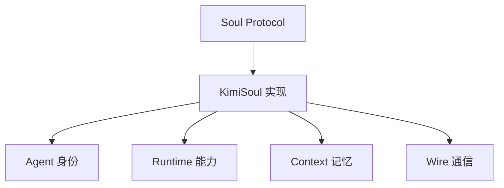
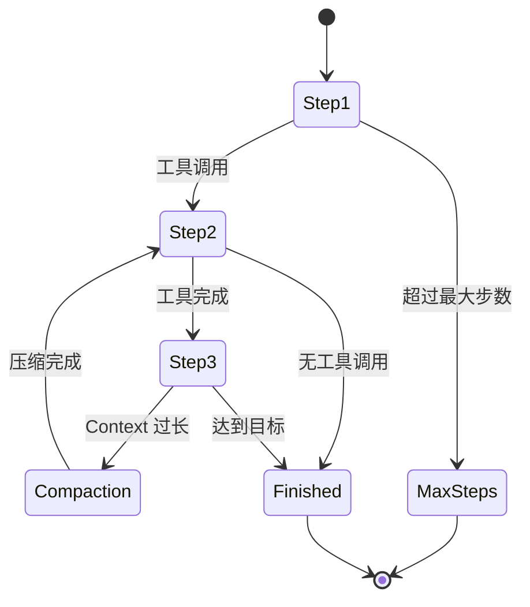

# Soul 模块 - AI Agent 核心引擎 🧠

## 🎯 模块概览

Soul 模块是 Kimi CLI 的**AI 大脑**，实现了 AI Agent 的完整生命周期。它采用**分层架构**设计，通过 Protocol 定义接口、工厂模式创建实例、Wire 机制通信，实现了一个优雅、可扩展的 AI 引擎。

---

## 📂 模块文件结构

```
my_cli/soul/
├── __init__.py              # 核心接口 + 工厂函数 + Wire 机制
├── kimisoul.py             # KimiSoul 具体实现（Agent 循环）
├── agent.py                # Agent 定义 + load_agent() 加载
├── runtime.py              # Runtime 运行时（LLM + 配置）
├── context.py              # Context 上下文管理
├── approval.py             # Approval 批准系统
├── denwarenji.py           # DenwaRenji 时空穿越机制
├── compaction.py           # Context 压缩优化
├── message.py              # 消息处理工具
└── toolset.py              # Toolset 工具集协议
```

---

## 🏗️ 架构设计

### 三层抽象架构



### 核心组件职责

| 组件 | 职责 | 设计模式 |
|------|------|----------|
| **Soul** | 抽象接口，定义 AI Agent 协议 | Protocol |
| **KimiSoul** | 具体实现，Agent 主循环 | 组合模式 |
| **Agent** | 身份定义（名称 + 系统提示词 + 工具） | 数据类 |
| **Runtime** | 运行时环境（LLM + 配置 + Approval） | 配置驱动 |
| **Context** | 对话上下文管理（历史 + 压缩） | 状态管理 |
| **Wire** | 与 UI 的异步通信机制 | 发布-订阅 |

---

## 📄 文件详解

### 1. `__init__.py` - 核心接口与工厂

**核心抽象**:

```python
@runtime_checkable
class Soul(Protocol):
    """Soul Protocol - AI Agent 核心引擎的接口定义"""

    @property
    def name(self) -> str: ...

    @property
    def model_name(self) -> str: ...

    @property
    def model_capabilities(self) -> set[str] | None: ...

    @property
    def status(self) -> StatusSnapshot: ...

    async def run(self, user_input: str): ...
```

**优雅之处**:
1. **Protocol 驱动**: 使用 Protocol 定义接口，而非抽象基类
2. **类型安全**: 完整的类型注解，IDE 支持友好
3. **运行时检查**: `@runtime_checkable` 支持 `isinstance()` 检查

**工厂函数**:

```python
async def create_soul(...) -> KimiSoul:
    """便捷工厂函数 - 创建 KimiSoul 实例"""
    # 1. 加载配置文件
    config = load_config(config_file)

    # 2. 创建 LLM
    llm = create_llm(provider, model, stream=True)

    # 3. 创建 Runtime
    runtime = Runtime(llm=llm, max_steps=20)

    # 4. 加载 Agent（使用依赖注入）
    loaded_agent = await load_agent(DEFAULT_AGENT_FILE, runtime)

    # 5. 创建 Context
    context = Context(session.history_file)
    await context.restore()

    # 6. 创建 KimiSoul
    soul = KimiSoul(agent=loaded_agent, runtime=runtime, context=context)
    return soul
```

**优雅之处**:
1. **配置驱动**: 通过配置文件和工厂函数创建实例
2. **依赖注入**: `load_agent()` 自动注入 Runtime、Approval 等依赖
3. **延迟初始化**: 使用 async 工厂函数，避免循环导入

**Wire 机制核心函数**:

```python
# ContextVar: 线程安全的全局变量
_current_wire = ContextVar[Wire | None]("current_wire", default=None)

def wire_send(msg: WireMessage) -> None:
    """发送消息到当前 Wire"""
    wire = get_wire_or_none()
    assert wire is not None
    wire.soul_side.send(msg)

async def run_soul(soul, user_input, ui_loop_fn, cancel_event):
    """运行 Soul 并连接到 UI Loop"""
    # 1. 创建 Wire 并设置到 ContextVar
    wire = Wire()
    wire_token = _current_wire.set(wire)

    # 2. 启动 UI Loop 任务
    ui_task = asyncio.create_task(ui_loop_fn(wire.ui_side))

    # 3. 启动 Soul 任务
    soul_task = asyncio.create_task(soul.run(user_input))

    # 4. 等待任意任务完成
    await asyncio.wait([soul_task, cancel_event_task], return_when=asyncio.FIRST_COMPLETED)

    # 5. 关闭 Wire 并清理
    wire.shutdown()
    _current_wire.reset(wire_token)
```

**优雅之处**:
1. **ContextVar 模式**: 线程安全的全局状态管理
2. **任务协调**: 使用 `asyncio.wait()` 精确控制任务
3. **优雅退出**: shutdown + 资源清理

### 2. `kimisoul.py` - KimiSoul 具体实现

**核心 Agent 循环**:

```python
async def _agent_loop(self):
    """主 Agent 循环"""
    step_no = 1
    while True:
        # 1. 发送步骤开始事件
        wire_send(StepBegin(n=step_no))

        # 2. 启动 Approval 管道（异步处理批准请求）
        approval_task = asyncio.create_task(_pipe_approval_to_wire())

        try:
            # 3. 必要时压缩 Context
            if self._context.token_count + self._reserved_tokens >= self._runtime.llm.max_context_size:
                wire_send(CompactionBegin())
                await self.compact_context()
                wire_send(CompactionEnd())

            # 4. 执行单步
            await self._checkpoint()
            self._denwa_renji.set_n_checkpoints(self._context.n_checkpoints)
            finished = await self._step()

        except BackToTheFuture as e:
            # 5. 时空穿越（D-Mail 机制）
            await self._context.revert_to(e.checkpoint_id)
            await self._checkpoint()
            await self._context.append_message(e.messages)
            continue

        finally:
            approval_task.cancel()  # 清理 Approval 任务

        # 6. 检查是否完成
        if finished:
            return

        step_no += 1
        if step_no > self._loop_control.max_steps_per_run:
            raise MaxStepsReached(self._loop_control.max_steps_per_run)
```

**优雅之处**:
1. **异步管道**: 并行处理 Approval 请求和工具执行
2. **状态管理**: 使用 Checkpoint 机制支持回滚
3. **时空穿越**: D-Mail 机制允许 Agent 给过去的自己发消息
4. **智能压缩**: 自动检测 Context 长度并压缩

**单步执行与重试**:

```python
@tenacity.retry(
    retry=retry_if_exception(self._is_retryable_error),
    wait=wait_exponential_jitter(initial=0.3, max=5, jitter=0.5),
    stop=stop_after_attempt(self._loop_control.max_retries_per_step),
)
async def _kosong_step_with_retry() -> StepResult:
    return await kosong.step(
        chat_provider.with_thinking(self._thinking_effort),
        self._agent.system_prompt,
        self._agent.toolset,
        self._context.history,
        on_message_part=wire_send,  # 流式输出回调
        on_tool_result=wire_send,   # 工具结果回调
    )
```

**优雅之处**:
1. **重试机制**: 使用 tenacity 实现指数退避重试
2. **幂等性**: 对网络错误自动重试，提升可靠性
3. **回调机制**: 通过回调实时发送流式输出

### 3. `agent.py` - Agent 身份与依赖注入

**Agent 定义**:

```python
@dataclass(frozen=True, slots=True, kw_only=True)
class Agent:
    """Agent - 定义 AI Agent 的身份和能力"""
    name: str
    system_prompt: str
    toolset: Toolset
```

**优雅之处**:
1. **不可变数据**: 使用 frozen + slots 保证数据安全
2. **单一职责**: Agent 只负责身份定义，不关心运行时

**依赖注入机制**:

```python
async def load_agent(agent_file, runtime, *, mcp_configs=None) -> Agent:
    """从规范文件加载 Agent"""
    # 1. 工具依赖注入映射
    tool_deps: dict[type, Any] = {
        ResolvedAgentSpec: agent_spec,
        Runtime: runtime,
        Config: runtime.config,
        BuiltinSystemPromptArgs: runtime.builtin_args,
        Session: runtime.session,
        DenwaRenji: runtime.denwa_renji,
        Approval: runtime.approval,
    }

    # 2. 使用 inspect.signature 自动注入依赖
    for param in inspect.signature(cls).parameters.values():
        if param.kind == inspect.Parameter.KEYWORD_ONLY:
            break  # 遇到 keyword-only 参数时停止注入
        if param.annotation not in dependencies:
            raise ValueError(f"Tool dependency not found: {param.annotation}")
        args.append(dependencies[param.annotation])

    return cls(*args)
```

**优雅之处**:
1. **自动注入**: 使用 inspect.signature 自动匹配依赖
2. **类型安全**: 通过类型注解确保依赖正确性
3. **灵活扩展**: 支持 keyword-only 参数（手动注入特殊依赖）

### 4. `runtime.py` - Runtime 运行时环境

（详细内容需要查看 runtime.py 文件）

### 5. `context.py` - Context 上下文管理

（详细内容需要查看 context.py 文件）

### 6. `approval.py` - Approval 批准系统

（详细内容需要查看 approval.py 文件）

### 7. `denwarenji.py` - 时空穿越机制

（详细内容需要查看 denwarenji.py 文件）

### 8. `compaction.py` - Context 压缩优化

（详细内容需要查看 compaction.py 文件）

### 9. `message.py` - 消息处理工具

（详细内容需要查看 message.py 文件）

### 10. `toolset.py` - Toolset 工具集协议

（详细内容需要查看 toolset.py 文件）

---

## 🌟 设计优雅之处

### 1. Protocol 优于继承

**传统抽象基类**:

```python
from abc import ABC, abstractmethod

class Soul(ABC):
    @abstractmethod
    async def run(self, user_input: str):
        pass
```

**Protocol 方式**:

```python
from typing import Protocol

class Soul(Protocol):
    async def run(self, user_input: str):
        ...
```

**优势**:
- ✅ **鸭子类型**: 任何实现了接口的类都是 `Soul`
- ✅ **无需继承**: 保持实现类的灵活性
- ✅ **运行时检查**: `@runtime_checkable` 支持 `isinstance()`
- ✅ **类型安全**: 完整的类型提示支持

### 2. 工厂模式解耦创建逻辑

**问题**: 直接实例化会导致依赖混乱

```python
# ❌ 错误的做法
class KimiSoul:
    def __init__(self):
        # 直接创建依赖，难以测试和扩展
        self.llm = create_llm(...)
        self.toolset = SimpleToolset(...)
```

**解决**: 使用工厂函数

```python
# ✅ 正确的做法
async def create_soul(...) -> KimiSoul:
    # 1. 创建依赖
    config = load_config(...)
    llm = create_llm(...)
    runtime = Runtime(...)

    # 2. 注入依赖
    agent = await load_agent(...)
    context = Context(...)

    # 3. 创建并返回
    return KimiSoul(agent, runtime, context=context)
```

**优势**:
- ✅ **单一职责**: 创建逻辑集中在工厂中
- ✅ **易于测试**: 可以 mock 工厂函数
- ✅ **灵活扩展**: 可以在工厂中添加新逻辑

### 3. 依赖注入自动化

**问题**: 手动传递依赖容易出错

```python
# ❌ 手动传递
bash = Bash(approval=runtime.approval, config=runtime.config)
read_file = ReadFile(approval=runtime.approval, config=runtime.config)
```

**解决**: 自动化注入

```python
# ✅ 自动注入
tool_deps = {Approval: runtime.approval, Config: runtime.config}
for param in inspect.signature(cls).parameters.values():
    args.append(tool_deps[param.annotation])
tool = cls(*args)
```

**优势**:
- ✅ **减少样板代码**: 自动匹配并注入依赖
- ✅ **类型安全**: 通过类型注解确保依赖正确
- ✅ **易于扩展**: 新增依赖只需在映射中添加

### 4. 异步任务协调

**问题**: 多个异步任务需要精确协调

**解决**: 使用 `asyncio.wait()` + 事件

```python
async def run_soul(...):
    # 启动多个任务
    ui_task = asyncio.create_task(ui_loop_fn(wire.ui_side))
    soul_task = asyncio.create_task(soul.run(user_input))
    cancel_task = asyncio.create_task(cancel_event.wait())

    # 等待任意任务完成
    done, pending = await asyncio.wait(
        [soul_task, cancel_task],
        return_when=asyncio.FIRST_COMPLETED
    )

    # 根据完成的任务处理
    if cancel_event.is_set():
        soul_task.cancel()  # 取消 Soul 任务
```

**优势**:
- ✅ **精确控制**: 可以等待任意任务完成
- ✅ **资源清理**: 使用 try/finally 确保资源清理
- ✅ **错误处理**: 正确传播或捕获异常

### 5. 状态机设计

**Agent 循环状态机**:



**优雅之处**:
- ✅ **状态清晰**: 每一步都有明确的状态转换
- ✅ **可扩展**: 易于添加新的状态转换
- ✅ **健壮性**: 处理各种异常情况（取消、错误、时空穿越）

---

## 🔗 对外接口

### 上层接口（被 UI 层调用）

- **`create_soul()`** - 创建 Soul 实例的工厂函数
- **`run_soul()`** - 运行 Soul 并连接到 UI Loop
- **`wire_send()`** - 发送消息到 Wire（全局函数）
- **`get_wire_or_none()`** - 获取当前 Wire

### 下层接口（调用底层组件）

- **`load_agent()`** - 从规范文件加载 Agent
- **`KimiSoul.run()`** - 运行 AI Agent 主循环
- **`Context` API** - 管理对话上下文
- **`Runtime` API** - 获取 LLM 和配置

---

## 📊 与官方对比

| 特性 | 官方实现 | 我们的实现 | 一致性 |
|------|----------|------------|--------|
| Protocol 定义 | Soul Protocol | Soul Protocol | ✅ |
| 工厂模式 | create_soul() | create_soul() | ✅ |
| 依赖注入 | load_agent() | load_agent() | ✅ |
| Agent 循环 | KimiSoul._agent_loop() | KimiSoul._agent_loop() | ✅ |
| 重试机制 | tenacity.retry | tenacity.retry | ✅ |
| Wire 机制 | ContextVar + run_soul | ContextVar + run_soul | ✅ |
| D-Mail 机制 | BackToTheFuture 异常 | BackToTheFuture 异常 | ✅ |

---

## 🎓 学习要点

1. **Protocol 驱动设计**: 使用 Protocol 定义接口而非继承
2. **工厂模式解耦**: 通过工厂函数创建复杂对象
3. **依赖注入**: 使用 inspect.signature 自动注入依赖
4. **异步任务协调**: 使用 asyncio.wait() 精确控制任务
5. **状态机思维**: Agent 循环本质是状态机
6. **重试机制**: 使用 tenacity 实现幂等性
7. **资源管理**: try/finally 确保资源清理
8. **上下文管理**: Context + Checkpoint 支持回滚

---

## 🚀 总结

Soul 模块是整个项目的**核心大脑**，它的优雅设计体现在：

1. **分层清晰**: Protocol → 实现 → 工厂解耦创建
2. **依赖注入**: 自动化注入减少样板代码
3. **状态管理**: Context + Checkpoint 支持复杂状态
4. **任务协调**: 精确的异步任务控制
5. **容错机制**: 重试 + 优雅退出保证可靠性
6. **可扩展性**: 通过 Protocol 和工厂模式易于扩展

这是整个 CLI 的智能引擎，为 Agent 提供了一个完整、优雅、可靠的运行环境。

---

**创建时间**: 2025-11-22
**基于文档**: my_cli/soul/*.py, docs/stage-04-08-soul-engine.md
