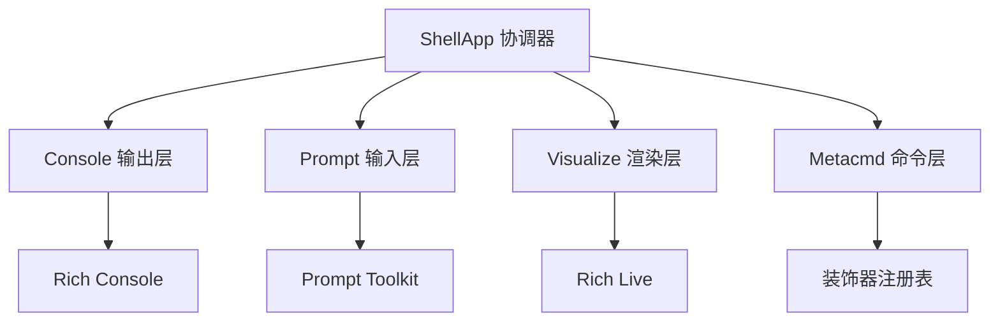

# UI 模块 - 多层用户界面系统 🎨

## 🎯 模块概览

UI 模块是 Kimi CLI 的**用户交互层**，采用**分层架构**设计，将输入处理、输出渲染、命令系统、解调器完全分离。它使用 Rich 库实现流式输出和交互式界面，支持 Shell、Print、ACP 三种 UI 模式，是整个系统中用户感知最强的模块。

---

## 📂 模块文件结构

```
my_cli/ui/
└── shell/                          # Shell UI 实现（主模式）
    ├── __init__.py                 # ShellApp 主入口（协调器）
    ├── console.py                  # Console 单例 + 主题配置
    ├── prompt.py                   # CustomPromptSession（输入处理）
    ├── visualize.py                # UI Loop 渲染（流式输出）
    ├── metacmd.py                  # 斜杠命令系统（装饰器注册）
    ├── keyboard.py                 # 键盘事件监听（跨平台）
    ├── debug.py                    # 调试功能（Wire 日志）
    ├── replay.py                   # 历史回放（会话恢复）
    ├── setup.py                    # 配置向导（交互式配置）
    └── update.py                   # 自动更新（后台任务）
```

---

## 🏗️ 架构设计

### 分层职责



### 核心模块职责

| 模块 | 职责 | 核心技术 |
|------|------|----------|
| **Console** | 全局输出单例 | Rich Console |
| **Prompt** | 输入会话管理 | Prompt Toolkit |
| **Visualize** | 实时渲染 | Rich Live + Async |
| **Metacmd** | 斜杠命令 | 装饰器模式 |
| **Keyboard** | 键盘监听 | 跨平台事件 |
| **ShellApp** | 整体协调 | 事件分发 |

---

## 📄 文件详解

### 1. `console.py` - 全局输出层

**核心设计**:

```python
# 自定义主题：中性 Markdown 渲染
_NEUTRAL_MARKDOWN_THEME = Theme(
    {
        "markdown.paragraph": "none",
        "markdown.block_quote": "none",
        "markdown.hr": "none",
        ...
    },
    inherit=True,
)

# 全局 Console 单例
console = Console(highlight=False, theme=_NEUTRAL_MARKDOWN_THEME)
```

**优雅之处**:
1. **单例模式**: 全局统一输出，避免重复创建
2. **主题配置**: 自定义主题避免 Markdown 自动高亮干扰
3. **禁用高亮**: `highlight=False` 防止误渲染用户输入
4. **单一职责**: 只负责输出，与输入逻辑分离

### 2. `prompt.py` - 输入层

**核心结构**:

```python
class CustomPromptSession:
    """自定义输入会话"""

    def __init__(
        self,
        status_provider: Callable[[], StatusSnapshot],
        model_capabilities: set[str],
        initial_thinking: bool,
    ):
        # 1. 创建 PromptSession
        self._session = PromptSession(
            history=FileHistory(history_file),
            completer=merge_completers([...]),
            key_bindings=bindings,
            validator=validator,
            style=style,
        )

        # 2. 注册状态栏刷新任务
        asyncio.create_task(self._refresh_status_loop())

    async def prompt(self) -> UserInput:
        """获取用户输入"""
        text = await self._session.prompt_async(...)
        return self._parse_user_input(text)
```

**优雅之处**:
1. **持久化历史**: 使用 `FileHistory` 持久化命令历史
2. **智能补全**: 合并多个补全器（文件路径、命令补全）
3. **状态栏**: 异步刷新显示 Context 使用率
4. **输入模式**: 支持 Normal/Shell/Thinking 三种模式
5. **Toast 通知**: 非阻塞提示系统

**Toast 通知系统**:

```python
_toast_queue: deque[_ToastEntry] = deque()

def toast(message: str, duration: float = 5.0, topic: str | None = None):
    """显示 Toast 通知"""
    _toast_queue.append(_ToastEntry(topic, message, duration))
    _show_next_toast()  # 显示队列中的下一个

# 使用场景
toast("配置已保存", topic="setup")
toast("Model 已切换", topic="model")
```

**优雅之处**:
- ✅ **非阻塞**: 不影响主输入流程
- ✅ **主题分组**: 相同 topic 的 Toast 只保留一个
- ✅ **自动消失**: 定时自动隐藏
- ✅ **队列管理**: FIFO 队列保证顺序显示

### 3. `visualize.py` - 渲染层（Compose 架构）

**核心设计 - Block 模式**:

```python
class _ContentBlock:
    """内容块：管理文本和思考内容"""

    def __init__(self, is_think: bool):
        self._parts: deque[ContentPart] = deque()
        self._is_think = is_think

    def append(self, part: ContentPart):
        """流式接收内容"""
        self._parts.append(part)

    def compose(self) -> RenderableType:
        """根据当前状态组合渲染内容"""
        if not self._parts:
            return Spinner("dots", text="思考中...") if self._is_think else Spinner("dots")

        # 将所有部分合并为 Markdown
        text = "".join(part.text for part in self._parts if isinstance(part, TextPart))
        return Markdown(text, theme="neutral")
```

**核心设计 - Compose 架构**:

```python
class _LiveView:
    """实时视图：组合所有 Block"""

    def __init__(self, initial_status: StatusSnapshot, cancel_event: asyncio.Event):
        self._blocks: dict[str, Block] = {
            "content": _ContentBlock(is_think=False),
            "thinking": _ContentBlock(is_think=True),
            "tool_call": _ToolCallBlock(),
            "approval": _ApprovalRequestPanel(...),
            "status": _StatusBlock(),
        }
        self._live = Live(refresh_per_second=10, console=console)

    async def render_loop(self, wire_ui: WireUISide):
        """渲染循环：接收消息并更新"""
        async for msg in wire_ui.receive():
            await self._handle_message(msg)
            self._live.update(self.compose())  # 重新组合所有 Block

    def compose(self) -> RenderableType:
        """重新组合所有 Block（Compose 架构核心）"""
        return Group(
            self._blocks["content"].compose(),
            self._blocks["thinking"].compose(),
            self._blocks["tool_call"].compose(),
            self._blocks["approval"].compose(),
            self._blocks["status"].compose(),
        )
```

**优雅之处**:
1. **Compose 架构**: 每次渲染都重新组合所有 Block
2. **Block 模式**: 每个 Block 管理一类内容，职责清晰
3. **流式增量**: 支持流式接收内容（append）
4. **状态驱动**: 根据当前状态组合不同渲染
5. **Rich Live**: 使用 `Live` 实现实时刷新
6. **刷新控制**: `refresh_per_second=10` 控制刷新频率

**_vs_ 累积架构**:

```python
# ❌ 旧架构（累积式）
class OldVisualize:
    def __init__(self):
        self.text = Text()  # 累积式

    def on_text(self, text):
        self.text.append(text)  # 只能累积，无法清除

    def render(self):
        console.print(self.text)  # 旧内容还在

# ✅ 新架构（Compose 式）
class NewVisualize:
    def compose(self):
        return Group(
            self._content_block.compose(),
            self._status_block.compose(),
            # 每次都重新组合！
        )
```

**优势对比**:
- ✅ **可清除**: 可以清除旧内容，重新开始
- ✅ **无重复**: 流式参数不会重复显示
- ✅ **状态驱动**: 根据状态显示不同内容
- ✅ **易于维护**: Block 职责单一，代码清晰

### 4. `metacmd.py` - 斜杠命令层

**核心设计 - 装饰器注册**:

```python
# 注册表：命令名 -> 命令对象
_META_COMMANDS: dict[str, MetaCommand] = {}

class MetaCommand:
    """元命令对象"""
    def __init__(self, name: str, func: Callable, description: str):
        self.name = name
        self.func = func
        self.description = description

def meta_command(name: str, description: str):
    """装饰器：注册斜杠命令"""
    def decorator(func):
        _META_COMMANDS[name] = MetaCommand(name, func, description)
        return func
    return decorator

# 使用示例
@meta_command("help", "显示帮助信息")
def cmd_help(app: ShellApp, args: list[str]):
    """帮助命令实现"""
    ...

@meta_command("setup", "配置 API Key")
def cmd_setup(app: ShellApp, args: list[str]):
    """设置命令实现"""
    ...
```

**优雅之处**:
1. **装饰器模式**: 简化命令注册（只需添加装饰器）
2. **声明式**: 命令定义靠近实现，代码可读性好
3. **集中管理**: 注册表统一管理所有命令
4. **参数传递**: 自动传递 ShellApp 实例和参数列表

### 5. `keyboard.py` - 键盘事件层

**跨平台实现**:

```python
async def listen_for_keyboard() -> AsyncIterator[KeyEvent]:
    """监听键盘事件（跨平台）"""
    if sys.platform.startswith("win"):
        # Windows: 使用 msvcrt
        import msvcrt
        while True:
            if msvcrt.kbhit():
                key = msvcrt.getch()
                yield KeyEvent(key)
    else:
        # Unix/Linux/macOS: 使用 termios
        import tty, termios
        fd = sys.stdin.fileno()
        old_settings = termios.tcgetattr(fd)
        try:
            tty.raw(sys.stdin)
            while True:
                ch = sys.stdin.read(1)
                yield KeyEvent(ch.encode())
        finally:
            termios.tcsetattr(fd, termios.TCSADRAIN, old_settings)
```

**优雅之处**:
1. **跨平台**: 自动检测平台并选择实现
2. **异步迭代**: 使用 `AsyncIterator` 提供事件流
3. **资源管理**: 使用 try/finally 确保终端设置恢复
4. **简单接口**: 统一的事件格式 `KeyEvent`

### 6. `__init__.py` - ShellApp 协调器

**核心结构**:

```python
class ShellApp:
    """Shell App - 模块化的交互式 UI"""

    async def run(self, command: str | None = None) -> bool:
        """运行 Shell App（支持单命令和交互模式）"""

        # 模式 1：单命令模式
        if command is not None:
            return await self._run_single_command(command)

        # 模式 2：交互循环模式
        with CustomPromptSession(...) as prompt_session:
            while True:
                # 1. 获取用户输入
                user_input = await prompt_session.prompt()

                # 2. 处理特殊命令
                if user_input.command.lower() in ["exit", "quit"]:
                    break

                # 3. 处理 Shell 模式
                if user_input.mode == PromptMode.SHELL:
                    await self._run_shell_command(user_input.command)
                    continue

                # 4. 处理斜杠命令
                if user_input.command.startswith("/"):
                    await self._run_meta_command(user_input.command[1:])
                    continue

                # 5. 处理普通命令（发送到 Soul）
                await self._run_soul_command(user_input.content)
```

**优雅之处**:
1. **双模式支持**: 单命令 + 交互循环
2. **模块化协调**: 协调 Prompt、MetaCmd、Shell、Soul
3. **异常处理**: 分层处理不同类型的异常
4. **信号处理**: 正确处理 Ctrl+C 取消操作

**异常分层处理**:

```python
except LLMNotSet:
    console.print("[red]❌ LLM 未设置[/red]")
except ChatProviderError as e:
    console.print(f"[red]❌ LLM API 错误: {e}[/red]")
except ToolRejectedError as e:
    logger.info("Tool rejected by user: {brief}", brief=e.brief)  # 正常情况
except RunCancelled:
    pass  # 取消操作，静默处理
except Exception as e:
    console.print(f"[red]❌ 未知错误: {e}[/red]")  # 真正需要用户关注的错误
```

**优雅之处**:
- ✅ **分层处理**: 不同异常不同处理策略
- ✅ **用户友好**: 错误信息清晰，不显示技术细节
- ✅ **正常流程**: ToolRejectedError 是正常交互，记录日志即可
- ✅ **避免打扰**: RunCancelled 静默处理，不显示错误

---

## 🌟 设计优雅之处

### 1. 分层架构解耦

**输入层与输出层分离**:

```python
# 输入层：Prompt（只负责输入）
class CustomPromptSession:
    async def prompt() -> UserInput: ...

# 输出层：Console（只负责输出）
console.print(...)

# 协调层：ShellApp（协调输入输出）
class ShellApp:
    async def run(...):
        user_input = await self._prompt.prompt()  # 输入
        await self._visualize.render(...)         # 输出
```

**优势**:
- ✅ **职责清晰**: 输入和输出完全分离
- ✅ **易于测试**: 可以分别测试输入和输出逻辑
- ✅ **可替换**: 可以替换输入或输出实现而不影响其他层

### 2. Block 模式

**内容按类型管理**:

```python
class _LiveView:
    _blocks = {
        "content": _ContentBlock(),   # 文本内容
        "thinking": _ContentBlock(),  # 思考模式
        "tool_call": _ToolCallBlock(),# 工具调用
        "approval": _ApprovalBlock(), # 批准请求
        "status": _StatusBlock(),     # 状态栏
    }
```

**优势**:
- ✅ **职责单一**: 每个 Block 只管理一类内容
- ✅ **状态隔离**: 不同 Block 独立管理状态
- ✅ **易于扩展**: 新增内容类型只需添加新 Block

### 3. Compose 架构

**动态组合渲染**:

```python
def compose(self) -> RenderableType:
    """根据当前状态动态组合"""
    children = []

    # 添加内容块
    if self._content_block.has_content():
        children.append(self._content_block.compose())

    # 添加工具调用块
    if self._tool_call_block.has_content():
        children.append(self._tool_call_block.compose())

    # 添加批准请求块
    if self._approval_block.is_active():
        children.append(self._approval_block.compose())

    return Group(*children)  # 动态组合
```

**优势**:
- ✅ **无状态冲突**: 每次都重新组合，没有状态残留
- ✅ **条件渲染**: 只渲染有内容的 Block
- ✅ **可定制**: 可以根据需要组合不同的 Block

### 4. 装饰器注册命令

**声明式命令定义**:

```python
@meta_command("help", "显示帮助信息")
def cmd_help(app: ShellApp, args: list[str]):
    """帮助命令实现"""
    ...

@meta_command("setup", "配置 API Key")
def cmd_setup(app: ShellApp, args: list[str]):
    """设置命令实现"""
    ...
```

**优势**:
- ✅ **代码内聚**: 命令定义靠近实现
- ✅ **自动注册**: 无需手动添加到注册表
- ✅ **类型安全**: 自动传递正确类型的参数

### 5. 事件驱动架构

**异步事件流**:

```python
# 键盘事件流
async for event in listen_for_keyboard():
    handler(event)

# Wire 消息流
async for msg in wire_ui.receive():
    await self._handle_message(msg)

# 状态刷新流
async for _ in async_timer(interval=1.0):
    self._refresh_status()
```

**优势**:
- ✅ **异步优先**: 全程异步，避免阻塞
- ✅ **事件驱动**: 基于事件流，易于扩展
- ✅ **资源高效**: 使用异步迭代器，按需处理

---

## 🔗 对外接口

### 上层接口（被 CLI 调用）

- **`ShellApp.run()`** - 运行 Shell UI（单命令或交互模式）
- **`CustomPromptSession.prompt()`** - 获取用户输入
- **`visualize()`** - 运行 UI Loop（渲染 Wire 消息）
- **`toast()`** - 显示通知（全局函数）

### 下层接口（调用底层库）

- **`console.print()`** - Rich Console 输出
- **`prompt_toolkit`** - 高级输入组件
- **`Rich Live`** - 实时渲染
- **`asyncio`** - 异步任务协调

---

## 📊 与官方对比

| 特性 | 官方实现 | 我们的实现 | 一致性 |
|------|----------|------------|--------|
| 模块化设计 | 6 个子模块 | 6 个子模块 | ✅ |
| Block 模式 | Content/Status/ToolCall | Content/Status/ToolCall | ✅ |
| Compose 架构 | compose() 重新组合 | compose() 重新组合 | ✅ |
| Prompt 增强 | FileHistory + Completer | FileHistory + Completer | ✅ |
| Toast 通知 | 队列管理 | 队列管理 | ✅ |
| 装饰器命令 | @meta_command | @meta_command | ✅ |
| 键盘监听 | 跨平台实现 | 跨平台实现 | ✅ |
| 异常分层 | LLMNotSet/ChatProviderError | 相同异常类 | ✅ |

---

## 🎓 学习要点

1. **分层架构**: 输入、输出、协调完全分离
2. **Compose 模式**: 重新组合优于累积式修改
3. **Block 模式**: 按内容类型管理状态
4. **装饰器注册**: 声明式简化注册流程
5. **异步事件流**: AsyncIterator 提供事件流
6. **跨平台兼容**: 自动检测平台并选择实现
7. **单例模式**: 全局资源统一管理
8. **异常分层**: 不同异常不同处理策略

---

## 🚀 总结

UI 模块是整个项目的**用户感知层**，它的优雅设计体现在：

1. **分层清晰**: 输入、输出、协调完全分离
2. **模块化**: 每个子模块职责单一，易于维护
3. **Compose 架构**: 动态组合而非累积式修改
4. **事件驱动**: 全程异步，事件流驱动
5. **跨平台**: 自动适配不同操作系统
6. **用户友好**: Toast 通知、状态栏、自动补全
7. **可扩展**: 新增 UI 类型只需实现接口

这是整个 CLI 的用户交互门面，为用户提供了流畅、美观、强大的交互体验。

---

**创建时间**: 2025-11-22
**基于文档**: my_cli/ui/shell/*.py, docs/stage-11-shell-ui.md
