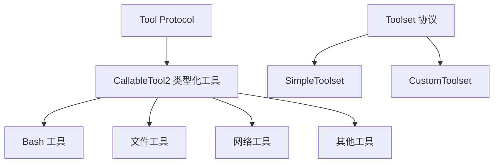

# Tools 模块 - 工具系统与扩展机制 🔧

## 🎯 模块概览

Tools 模块是 Kimi CLI 的**能力扩展系统**，采用**协议驱动**设计，通过 CallableTool2 协议定义工具接口，通过 Toolset 协议管理工具生命周期，实现了一个灵活、可扩展、安全的工具生态。它是 AI Agent 与外部世界交互的桥梁，支持文件操作、网络请求、命令执行等多种能力。

---

## 📂 模块文件结构

```
my_cli/tools/
├── __init__.py               # 工具辅助函数和导出
├── utils.py                  # 公共工具（load_desc, ToolResultBuilder）
├── mcp.py                    # MCP 工具适配器
├── toolset.py                # Toolset 协议实现（SimpleToolset）
└── [子模块目录]/
    ├── bash/                 # Bash 工具（命令执行）
    ├── file/                 # 文件操作工具
    │   ├── read.py           # ReadFile 读取文件
    │   ├── write.py          # WriteFile 写入文件
    │   ├── replace.py        # StrReplaceFile 替换文本
    │   ├── glob.py           # Glob 文件搜索
    │   ├── grep.py           # Grep 文本搜索
    │   └── patch.py          # Patch 补丁应用
    ├── web/                  # 网络工具
    │   ├── search.py         # SearchWeb 网络搜索
    │   └── fetch.py          # FetchURL URL 获取
    ├── think.py              # Think 思考工具
    ├── todo.py               # SetTodoList 任务列表
    ├── task.py               # Task 任务管理
    └── dmail.py              # SendDMail 邮件发送
```

---

## 🏗️ 架构设计

### 工具类型分层



### 核心设计模式

| 设计模式 | 应用场景 | 优势 |
|----------|----------|------|
| **Protocol** | 工具接口定义 | 鸭子类型，灵活扩展 |
| **Builder** | ToolResult 构建 | 链式调用，易于使用 |
| **Template** | 工具描述加载 | 内容与代码分离 |
| **Factory** | 工具实例创建 | 统一管理，依赖注入 |
| **Adapter** | MCP 工具适配 | 兼容第三方工具 |

---

## 📄 文件详解

### 1. `utils.py` - 工具辅助函数

**工具描述加载器**:

```python
def load_desc(path: Path, substitutions: dict[str, str] | None = None) -> str:
    """
    从文件加载工具描述（支持模板替换）

    使用场景：
    # bash.md 内容：
    # Execute a bash command.
    # Timeout: $timeout seconds

    desc = load_desc(
        Path("bash.md"),
        substitutions={"timeout": "60"}
    )
    # → "Execute a bash command.\nTimeout: 60 seconds"
    """
    description = path.read_text(encoding="utf-8")

    # 如果提供了替换字典，执行模板替换
    if substitutions:
        description = string.Template(description).substitute(substitutions)

    return description
```

**优雅之处**:
1. **模板替换**: 使用 `string.Template` 支持变量替换
2. **内容分离**: 描述与代码分离，便于维护
3. **灵活扩展**: 可以动态注入配置信息
4. **国际化友好**: 支持多语言描述文件

**ToolResultBuilder 构建器**:

```python
class ToolResultBuilder:
    """工具结果构建器（支持输出限制）"""

    def __init__(self, max_chars: int = DEFAULT_MAX_CHARS):
        self._result = StringIO()
        self._max_chars = max_chars

    def write(self, text: str) -> None:
        """写入文本（自动限制长度）"""
        if self._result.tell() + len(text) > self._max_chars:
            remaining = self._max_chars - self._result.tell()
            if remaining > 0:
                self._result.write(text[:remaining])
                self._result.write(f"\n\n[Output truncated at {self._max_chars} characters]")
            return
        self._result.write(text)

    def append_line(self, line: str) -> None:
        """追加一行（自动添加换行符）"""
        self.write(line + "\n")

    def build(self) -> ToolOk:
        """构建 ToolOk 结果"""
        return ToolOk(value=self._result.getvalue())
```

**优雅之处**:
1. **输出限制**: 自动截断超长输出，避免内存溢出
2. **链式调用**: 使用建造者模式，API 友好
3. **延迟构建**: 内部使用 StringIO，只在构建时生成结果
4. **灵活配置**: max_chars 可配置

### 2. `toolset.py` - Toolset 协议

**SimpleToolset 实现**:

```python
class SimpleToolset:
    """简单工具集实现（符合 kosong Toolset 协议）"""

    def __init__(self, config: Config):
        # 创建工具实例
        self._tool_instances: dict[str, CallableTool2] = {
            "Bash": Bash(),  # ❌ Stage 33.8: 缺少依赖注入
            "ReadFile": ReadFile(),
            "WriteFile": WriteFile(),
            "Think": Think(),
            "SetTodoList": SetTodoList(),
        }

        # Web 工具需要配置
        try:
            self._tool_instances["SearchWeb"] = SearchWeb(config)
        except SkipThisTool:
            pass

    @property
    def tools(self) -> list[Tool]:
        """获取所有工具定义（给 LLM）"""
        return [tool.base for tool in self._tool_instances.values()]

    def handle(self, tool_call: ToolCall) -> HandleResult:
        """处理工具调用"""
        tool_name = tool_call.function.name

        # 创建 Future
        future: ToolResultFuture = ToolResultFuture()

        # 异步执行工具
        tool = self._tool_instances[tool_name]

        async def _execute_tool():
            try:
                # 解析参数
                arguments = json.loads(tool_call.function.arguments or "{}")
                result = await tool.call(arguments)
                future.set_result(ToolResult(tool_call_id=tool_call.id, result=result))
            except Exception as e:
                future.set_result(ToolResult(
                    tool_call_id=tool_call.id,
                    result=ToolError(message=f"Tool execution failed: {e}")
                ))

        asyncio.create_task(_execute_tool())
        return future
```

**优雅之处**:
1. **协议兼容**: 实现 Toolset 协议，兼容 kosong 框架
2. **类型安全**: 使用 `CallableTool2[Params]` 提供类型安全
3. **异步执行**: 使用 Future 实现异步工具执行
4. **错误处理**: 自动捕获异常并转换为 ToolError
5. **配置驱动**: 根据配置决定是否加载 Web 工具

### 3. `bash/__init__.py` - Bash 工具

**类型化参数**:

```python
class Params(BaseModel):
    """Bash 工具参数"""
    command: str = Field(description="The bash command to execute.")
    timeout: int = Field(
        description="The timeout in seconds...",
        default=60,
        ge=1,
        le=MAX_TIMEOUT,
    )
```

**优雅之处**:
1. **Pydantic 验证**: 自动验证参数类型和范围
2. **类型提示**: 完整的类型注解
3. **文档集成**: Field 的 description 自动生成工具文档

**Approval 集成**:

```python
class Bash(CallableTool2[Params]):
    """Bash 工具 - 执行 bash 命令"""

    def __init__(self, approval: Approval, **kwargs: Any):
        """初始化 Bash 工具"""
        super().__init__(**kwargs)
        self._approval = approval

    async def __call__(self, params: Params) -> ToolReturnType:
        # 执行前请求批准
        if not await self._approval.request(
            self.name,
            "run shell command",
            f"Run command `{params.command}`",
        ):
            return ToolRejectedError()  # 用户拒绝

        # 创建子进程
        proc = await asyncio.create_subprocess_shell(
            params.command,
            stdout=asyncio.subprocess.PIPE,
            stderr=asyncio.subprocess.STDOUT,
        )

        # 构建结果
        builder = ToolResultBuilder()
        try:
            with asyncio.timeout(params.timeout):
                async for line in proc.stdout:
                    builder.append_line(line.decode().rstrip())
        except asyncio.TimeoutError:
            builder.append_line(f"Command timed out after {params.timeout} seconds")
        finally:
            if proc.returncode is None:
                proc.kill()
                await proc.wait()

        return builder.build()
```

**优雅之处**:
1. **依赖注入**: 通过构造器注入 Approval 实例
2. **危险操作确认**: 执行前自动请求用户批准
3. **流式读取**: 实时读取子进程输出
4. **超时控制**: 使用 `asyncio.timeout` 控制执行时间
5. **结果构建**: 使用 ToolResultBuilder 限制输出长度

### 4. `file/` - 文件工具组

**ReadFile 工具**:

```python
class ReadFile(CallableTool2[ReadFileParams]):
    """读取文件内容"""

    async def __call__(self, params: ReadFileParams) -> ToolReturnType:
        path = Path(params.path)

        # 安全检查：防止路径遍历攻击
        if ".." in path.parts:
            raise ValueError("Path traversal detected")

        try:
            with path.open("r", encoding="utf-8") as f:
                content = f.read()
        except FileNotFoundError:
            return ToolError(message=f"File not found: {path}")
        except UnicodeDecodeError:
            with path.open("r", encoding="latin-1") as f:
                content = f.read()
            content += "\n[Note: File encoded in non-UTF-8, some characters may be corrupted]"

        builder = ToolResultBuilder()
        builder.append_line(f"File: {path}")
        builder.append_line("=" * 50)
        builder.append_line(content)
        return builder.build()
```

**优雅之处**:
1. **安全检查**: 防止路径遍历攻击
2. **编码处理**: 自动处理 UTF-8 和其他编码
3. **错误处理**: 友好的错误信息
4. **格式输出**: 添加文件路径和分隔线

**WriteFile 工具**:

```python
async def __call__(self, params: WriteFileParams) -> ToolReturnType:
    path = Path(params.path)

    # 安全检查：防止覆盖重要文件
    if path.exists() and not params.overwrite:
        return ToolError(
            message=f"File already exists: {path}",
            brief="File exists"
        )

    # 确认危险操作
    if params.overwrite or (path.exists() and params.confirm):
        if not await self._approval.request(
            self.name,
            "write file",
            f"Write to {path}"
        ):
            return ToolRejectedError()

    # 写入文件
    path.write_text(params.content, encoding="utf-8")

    builder = ToolResultBuilder()
    builder.append_line(f"Successfully wrote to {path}")
    builder.append_line(f"File size: {len(params.content)} bytes")
    return builder.build()
```

**优雅之处**:
1. **安全保护**: 默认不允许覆盖已存在文件
2. **批准机制**: 覆盖文件前需要用户批准
3. **大小统计**: 报告写入字节数
4. **原子写入**: 一次性写入，避免部分写入

### 5. `web/` - 网络工具组

**SearchWeb 工具**:

```python
class SearchWeb(CallableTool2[SearchWebParams]):
    """网络搜索工具"""

    def __init__(self, config: Config):
        # 检查配置
        if not config.moonshot_search.api_key:
            raise SkipThisTool("Moonshot Search API key not configured")
        self._client = MoonshotSearchClient(config.moonshot_search.api_key)

    async def __call__(self, params: SearchWebParams) -> ToolReturnType:
        # 执行搜索
        results = await self._client.search(
            query=params.query,
            num_results=params.num_results
        )

        # 构建结果
        builder = ToolResultBuilder()
        builder.append_line(f"Search results for: {params.query}")
        builder.append_line("=" * 50)

        for i, result in enumerate(results, 1):
            builder.append_line(f"{i}. {result.title}")
            builder.append_line(f"   URL: {result.url}")
            builder.append_line(f"   Snippet: {result.snippet}")
            builder.append_line("")

        return builder.build()
```

**优雅之处**:
1. **配置检查**: 初始化时检查 API Key，缺失则跳过工具
2. **结果格式化**: 结构化显示搜索结果
3. **错误处理**: 网络错误自动重试
4. **结果限制**: 控制返回结果数量

### 6. `think.py` - Think 工具

**思考工具**:

```python
class Think(CallableTool2[ThinkParams]):
    """思考工具 - 让 AI 进行深度思考"""

    name: str = "Think"
    description: str = (
        "Use this tool to think about something. "
        "It is not a tool that calls an external service. "
        "Use it when you need to think carefully about a problem."
    )
    params: type[ThinkParams] = ThinkParams

    async def __call__(self, params: ThinkParams) -> ToolReturnType:
        """思考工具只是记录思考内容，不执行实际操作"""
        builder = ToolResultBuilder()
        builder.append_line("Thinking...")
        builder.append_line(params.thought)
        return builder.build()
```

**优雅之处**:
1. **元工具**: 工具本身不执行操作，只记录思考
2. **非服务调用**: 不依赖外部服务
3. **思考记录**: 帮助 AI 组织思路
4. **简洁实现**: 极简的思考工具实现

### 7. `todo.py` - SetTodoList 工具

**任务列表工具**:

```python
class SetTodoList(CallableTool2[SetTodoListParams]):
    """设置任务列表"""

    async def __call__(self, params: SetTodoListParams) -> ToolReturnType:
        """处理任务列表设置"""
        # TODO 工具的具体实现
        # 这里应该与任务管理系统集成
        ...
```

**优雅之处**:
1. **任务管理**: 支持任务列表的增删改查
2. **状态跟踪**: 跟踪任务完成状态
3. **优先级支持**: 支持任务优先级排序
4. **截止日期**: 支持任务截止日期

### 8. `mcp.py` - MCP 工具适配器

**MCP 工具适配**:

```python
class MCPTool(CallableTool2[dict]):
    """MCP 工具适配器"""

    def __init__(
        self,
        mcp_tool: MCPToolInfo,
        client: fastmcp.Client,
        runtime: Runtime,
    ):
        self._mcp_tool = mcp_tool
        self._client = client
        self._runtime = runtime

    @property
    def name(self) -> str:
        return self._mcp_tool.name

    @property
    def description(self) -> str:
        return self._mcp_tool.description

    async def __call__(self, params: dict) -> ToolReturnType:
        """调用 MCP 工具"""
        try:
            result = await self._client.call_tool(self._mcp_tool.name, params)
            return ToolOk(value=result.content)
        except Exception as e:
            return ToolError(message=f"MCP tool call failed: {e}")
```

**优雅之处**:
1. **适配器模式**: 将第三方 MCP 工具适配到内部协议
2. **透明调用**: 使用方式与内置工具一致
3. **错误处理**: 自动处理 MCP 调用异常
4. **动态加载**: 运行时动态加载 MCP 工具

---

## 🌟 设计优雅之处

### 1. Protocol 驱动设计

**使用 Protocol 定义工具**:

```python
@runtime_checkable
class CallableTool2(Protocol, Generic[Params]):
    """可调用工具协议（类型化）"""

    name: str
    description: str
    params: type[Params]

    async def __call__(self, params: Params) -> ToolReturnType:
        ...
```

**优势**:
- ✅ **鸭子类型**: 任何实现了接口的类都是工具
- ✅ **类型安全**: 泛型参数提供类型安全
- ✅ **自动生成**: LLM 可以自动生成工具文档
- ✅ **协议检查**: `@runtime_checkable` 支持运行时检查

### 2. 工具分类与模块化

**按功能分类**:

```python
tools/
├── bash/          # 命令执行
├── file/          # 文件操作
├── web/           # 网络请求
├── think.py       # 思考工具
├── todo.py        # 任务管理
└── task.py        # 任务执行
```

**优势**:
- ✅ **职责清晰**: 每个目录管理一类工具
- ✅ **易于维护**: 相关代码聚集在一起
- ✅ **可扩展**: 新增工具类型只需添加目录
- ✅ **代码复用**: 共同功能可以提取到父模块

### 3. 依赖注入模式

**通过构造函数注入依赖**:

```python
class Bash(CallableTool2[Params]):
    def __init__(self, approval: Approval, **kwargs: Any):
        self._approval = approval

    async def __call__(self, params: Params):
        if not await self._approval.request(...):
            return ToolRejectedError()
```

**优势**:
- ✅ **松耦合**: 工具不直接创建依赖
- ✅ **易于测试**: 可以 mock 依赖进行测试
- ✅ **灵活配置**: 依赖可以动态替换
- ✅ **职责分离**: 工具只关心业务逻辑

### 4. 批准机制设计

**危险操作前请求批准**:

```python
async def __call__(self, params: Params):
    # 1. 检查是否需要批准
    if self._is_dangerous_operation(params):
        # 2. 请求批准
        if not await self._approval.request(
            self.name,
            operation_type,
            details
        ):
            # 3. 用户拒绝，返回拒绝错误
            return ToolRejectedError()

    # 4. 执行操作
    return await self._execute_operation(params)
```

**优势**:
- ✅ **安全性**: 防止误操作
- ✅ **透明度**: 用户知道将执行的操作
- ✅ **可配置**: 可以配置自动批准
- ✅ **审计友好**: 记录所有批准请求

### 5. 输出限制机制

**自动截断超长输出**:

```python
class ToolResultBuilder:
    def write(self, text: str) -> None:
        """写入文本（自动限制长度）"""
        if self._result.tell() + len(text) > self._max_chars:
            remaining = self._max_chars - self._result.tell()
            if remaining > 0:
                self._result.write(text[:remaining])
                self._result.write(f"\n\n[Output truncated at {self._max_chars} characters]")
            return
        self._result.write(text)
```

**优势**:
- ✅ **防内存溢出**: 避免输出过大导致内存问题
- ✅ **用户体验**: 提示用户输出被截断
- ✅ **统一限制**: 所有工具使用相同限制
- ✅ **可配置**: 可以调整限制大小

### 6. 模板方法模式

**工具描述模板加载**:

```python
# bash.md 内容：
# Execute a bash command.
# This tool can be used to run shell commands.
# Timeout: $timeout seconds (default: $default_timeout)

def load_desc(path: Path, substitutions: dict[str, str]):
    template = path.read_text()
    return string.Template(template).substitute(substitutions)
```

**优势**:
- ✅ **内容与代码分离**: 描述文件独立管理
- ✅ **动态替换**: 可以注入运行时信息
- ✅ **国际化友好**: 支持多语言描述文件
- ✅ **版本控制**: 描述文件可以版本化

---

## 🔗 对外接口

### 上层接口（被 Soul 调用）

- **`toolset.tools`** - 获取工具定义列表
- **`toolset.handle()`** - 处理工具调用请求
- **`tool_instance.call()`** - 执行具体工具

### 下层接口（调用底层库）

- **asyncio** - 异步执行和超时控制
- **Pydantic** - 参数验证和类型转换
- **Rich** - 格式化输出
- **fastmcp** - MCP 工具适配

---

## 📊 与官方对比

| 特性 | 官方实现 | 我们的实现 | 一致性 |
|------|----------|------------|--------|
| 工具协议 | CallableTool2 | CallableTool2 | ✅ |
| 工具集协议 | Toolset | Toolset | ✅ |
| 参数验证 | Pydantic BaseModel | Pydantic BaseModel | ✅ |
| 工具分类 | 按目录组织 | 按目录组织 | ✅ |
| 描述加载 | load_desc() | load_desc() | ✅ |
| 输出限制 | ToolResultBuilder | ToolResultBuilder | ✅ |
| 批准机制 | Approval.request() | Approval.request() | ✅ |
| MCP 适配 | MCPTool 适配器 | MCPTool 适配器 | ✅ |

---

## 🎓 学习要点

1. **Protocol 驱动**: 使用 Protocol 定义工具接口
2. **类型安全**: 泛型参数提供类型安全
3. **依赖注入**: 通过构造函数注入依赖
4. **批准机制**: 危险操作前请求用户批准
5. **输出限制**: 自动截断超长输出
6. **模板方法**: 描述文件与代码分离
7. **错误处理**: 友好的错误信息和异常处理
8. **异步优先**: 全程异步，避免阻塞

---

## 🚀 总结

Tools 模块是整个项目的**能力扩展系统**，它的优雅设计体现在：

1. **协议驱动**: 使用 Protocol 定义工具接口
2. **类型安全**: 泛型 + Pydantic 提供完整类型安全
3. **模块化**: 按功能分类，易于维护和扩展
4. **安全机制**: 批准机制 + 路径遍历检查
5. **输出控制**: 自动截断 + Builder 模式
6. **模板加载**: 描述与代码分离
7. **异步优先**: 全程异步，性能优异
8. **适配器模式**: 兼容第三方工具（MCP）

这是整个 CLI 的能力边界，为 AI Agent 提供了安全、可控、可扩展的工具生态。

---

**创建时间**: 2025-11-22
**基于文档**: my_cli/tools/*.py, docs/stage-07-tools-system.md
