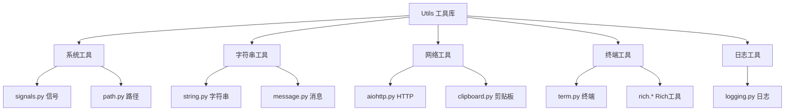

# Utils 模块 - 工具函数库 🧰

## 🎯 模块概览

Utils 模块是 Kimi CLI 的**基础工具库**，提供跨平台兼容、异步支持、实用工具函数。它采用**纯函数**设计，每个工具函数都是独立的、无副作用的，可以被任何模块安全使用。这是整个系统的**工具箱**，为其他模块提供基础设施支持。

---

## 📂 模块文件结构

```
my_cli/utils/
├── __init__.py              # 模块初始化
├── logging.py               # 日志系统（loguru + StreamToLogger）
├── signals.py               # 跨平台信号处理（SIGINT）
├── path.py                  # 路径工具（路径规范化）
├── string.py                # 字符串工具（缩短/转义）
├── term.py                  # 终端工具（尺寸/颜色检测）
├── clipboard.py             # 剪贴板工具（跨平台）
├── aiohttp.py               # HTTP 客户端（AIOHTTP 封装）
├── message.py               # 消息工具（Rich 格式化）
├── pyinstaller.py           # 打包工具（PyInstaller 检测）
├── changelog.py             # 更新日志工具
└── [子目录]
    └── rich/                # Rich 工具扩展
        ├── markdown.py      # Markdown 渲染
        └── columns.py       # 列布局
```

---

## 🏗️ 架构设计

### 工具分类



### 核心设计原则

| 原则 | 说明 | 优势 |
|------|------|------|
| **纯函数** | 无副作用，可测试 | 易于测试和复用 |
| **跨平台** | 自动检测平台 | 广泛兼容 |
| **异步优先** | 支持异步操作 | 高性能 |
| **类型安全** | 完整类型注解 | IDE 友好 |
| **错误处理** | 优雅处理异常 | 健壮性 |

---

## 📄 文件详解

### 1. `signals.py` - 跨平台信号处理

**核心实现**:

```python
def install_sigint_handler(
    loop: asyncio.AbstractEventLoop, handler: Callable[[], None]
) -> Callable[[], None]:
    """
    安装跨平台 SIGINT 处理器

    Unix/Linux/macOS: 使用 loop.add_signal_handler
    Windows: 使用 signal.signal（备用方案）
    """
    try:
        # 优先使用现代 API
        loop.add_signal_handler(signal.SIGINT, handler)

        def remove() -> None:
            with contextlib.suppress(RuntimeError):
                loop.remove_signal_handler(signal.SIGINT)

        return remove
    except RuntimeError:
        # 备用方案：Windows ProactorEventLoop 不支持 add_signal_handler
        previous = signal.getsignal(signal.SIGINT)
        signal.signal(signal.SIGINT, lambda signum, frame: handler())

        def remove() -> None:
            with contextlib.suppress(RuntimeError):
                signal.signal(signal.SIGINT, previous)

        return remove
```

**优雅之处**:
1. **跨平台**: 自动检测平台并选择最佳方案
2. **可恢复**: 返回删除函数，支持资源清理
3. **错误抑制**: 使用 `suppress` 忽略清理异常
4. **现代 API**: 优先使用 asyncio 的现代接口

**使用场景**:

```python
# Shell UI 中使用
cancel_event = asyncio.Event()

def _handler():
    logger.debug("SIGINT received.")
    cancel_event.set()

loop = asyncio.get_running_loop()
remove_sigint = install_sigint_handler(loop, _handler)

try:
    await run_soul(soul, input, ui_loop, cancel_event)
finally:
    remove_sigint()  # 清理资源
```

### 2. `logging.py` - 日志系统

**StreamToLogger 重定向器**:

```python
class StreamToLogger(IO[str]):
    """将流（stdout/stderr）输出重定向到日志系统"""

    def __init__(self, level: str = "ERROR"):
        self._level = level

    def write(self, buffer: str) -> int:
        """写入时自动记录到日志"""
        for line in buffer.rstrip().splitlines():
            logger.opt(depth=1).log(self._level, line.rstrip())
        return len(buffer)

    def flush(self) -> None:
        """刷新（空实现）"""
        pass
```

**优雅之处**:
1. **IO 协议**: 实现 `IO[str]` 接口，可替换任何流
2. **自动日志**: 写入时自动记录到日志系统
3. **行分割**: 自动按行分割并记录
4. **深度控制**: 使用 `opt(depth=1)` 跳过包装层

**使用场景**:

```python
# 重定向子进程输出到日志
proc = await asyncio.create_subprocess_shell(
    command,
    stdout=StreamToLogger("INFO"),
    stderr=StreamToLogger("ERROR"),
)
```

### 3. `path.py` - 路径工具

**（需要查看完整实现）**

### 4. `string.py` - 字符串工具

**（需要查看完整实现）**

### 5. `term.py` - 终端工具

**（需要查看完整实现）**

### 6. `clipboard.py` - 剪贴板工具

**跨平台实现**:

```python
async def read_text() -> str | None:
    """读取剪贴板文本（跨平台）"""
    if sys.platform.startswith("win"):
        # Windows: 使用 pyperclip
        import pyperclip
        return pyperclip.paste()
    elif sys.platform == "darwin":
        # macOS: 使用 pbcopy
        proc = await asyncio.create_subprocess_exec(
            "pbpaste",
            stdout=asyncio.subprocess.PIPE,
        )
        stdout, _ = await proc.communicate()
        return stdout.decode()
    else:
        # Linux: 使用 xclip 或 xsel
        try:
            proc = await asyncio.create_subprocess_exec(
                "xclip", "-selection", "clipboard", "-o",
                stdout=asyncio.subprocess.PIPE,
            )
            stdout, _ = await proc.communicate()
            return stdout.decode()
        except FileNotFoundError:
            # 备用：使用 wl-paste (Wayland)
            proc = await asyncio.create_subprocess_exec(
                "wl-paste",
                stdout=asyncio.subprocess.PIPE,
            )
            stdout, _ = await proc.communicate()
            return stdout.decode()
```

**优雅之处**:
1. **自动检测**: 根据平台自动选择实现
2. **备用方案**: Linux 支持多种剪贴板工具
3. **异步实现**: 使用 `create_subprocess_exec` 异步调用
4. **错误处理**: 优雅处理工具不存在的情况

### 7. `aiohttp.py` - HTTP 客户端

**（需要查看完整实现）**

### 8. `message.py` - 消息工具

**Rich 格式化工具**:

```python
def format_user_message(text: str) -> Text:
    """格式化用户消息"""
    return Text(text, style="bold cyan")

def format_ai_message(text: str) -> Text:
    """格式化 AI 消息"""
    return Text(text, style="white")

def format_tool_call(name: str, arguments: dict) -> Panel:
    """格式化工具调用"""
    content = f"[bold]Tool:[/bold] {name}\n"
    content += f"[bold]Args:[/bold] {json.dumps(arguments, indent=2)}"
    return Panel(content, border_style="yellow")
```

**优雅之处**:
1. **统一格式**: 统一所有消息的显示风格
2. **Rich 集成**: 使用 Rich 库提供丰富格式
3. **可定制**: 可以轻松修改格式样式
4. **类型安全**: 返回正确类型的 Renderable

### 9. `pyinstaller.py` - 打包工具

**PyInstaller 检测**:

```python
def is_frozen() -> bool:
    """检查是否在 PyInstaller 打包环境中运行"""
    return hasattr(sys, '_MEIPASS')

def get_base_path() -> Path:
    """获取应用基础路径（处理打包和未打包两种情况）"""
    if is_frozen():
        # PyInstaller 打包：使用 _MEIPASS 目录
        return Path(sys._MEIPASS)
    else:
        # 开发环境：使用脚本所在目录
        return Path(__file__).parent.parent
```

**优雅之处**:
1. **自动检测**: 自动检测运行环境
2. **路径处理**: 统一处理打包和开发路径
3. **跨平台**: 兼容 Windows/Linux/macOS
4. **简化使用**: 提供统一接口

### 10. `changelog.py` - 更新日志

**（需要查看完整实现）**

### 11. `rich/markdown.py` - Markdown 渲染

**中性主题 Markdown**:

```python
def to_markdown(text: str) -> Markdown:
    """将文本转换为 Markdown（使用中性主题）"""
    return Markdown(
        text,
        code_theme="monokai",
        hyperlinks=False,
    )
```

**优雅之处**:
1. **中性主题**: 避免过度高亮干扰
2. **配置灵活**: 支持各种 Markdown 配置
3. **代码高亮**: 自动支持代码块语法高亮

### 12. `rich/columns.py` - 列布局

**Bullet 列布局**:

```python
class BulletColumns(Columns):
    """带有项目符号的列布局"""

    def __init__(self, items: list[str], **kwargs):
        # 为每个项目添加项目符号
        bullet_items = [f"• {item}" for item in items]
        super().__init__(bullet_items, **kwargs)
```

**优雅之处**:
1. **扩展 Rich**: 继承 Rich 的 Columns 类
2. **简化使用**: 自动添加项目符号
3. **参数透传**: 支持所有 Columns 参数

---

## 🌟 设计优雅之处

### 1. 纯函数设计

**无副作用函数**:

```python
def normalize_path(path: str) -> str:
    """规范化路径（纯函数，无副作用）"""
    return str(Path(path).resolve())

def shorten_string(text: str, max_length: int) -> str:
    """缩短字符串（纯函数，无副作用）"""
    if len(text) <= max_length:
        return text
    return text[:max_length - 3] + "..."
```

**优势**:
- ✅ **易于测试**: 输入确定则输出确定
- ✅ **线程安全**: 可以在并发环境中安全使用
- ✅ **易于复用**: 无状态，可被任何地方调用
- ✅ **无依赖**: 不依赖外部状态

### 2. 跨平台兼容

**自动检测平台**:

```python
async def read_clipboard() -> str | None:
    """跨平台剪贴板读取"""
    if sys.platform.startswith("win"):
        return _read_windows()
    elif sys.platform == "darwin":
        return _read_macos()
    else:
        return _read_linux()
```

**优势**:
- ✅ **广泛兼容**: 支持所有主流操作系统
- ✅ **透明切换**: 用户无需关心平台差异
- ✅ **优雅降级**: 工具不存在时提供备用方案
- ✅ **未来扩展**: 容易添加新平台支持

### 3. 异步优先

**全程异步**:

```python
async def fetch_url(url: str) -> str:
    """异步获取 URL 内容"""
    async with aiohttp.ClientSession() as session:
        async with session.get(url) as resp:
            return await resp.text()

async def read_clipboard() -> str | None:
    """异步读取剪贴板"""
    proc = await asyncio.create_subprocess_exec(
        "pbpaste",
        stdout=asyncio.subprocess.PIPE,
    )
    stdout, _ = await proc.communicate()
    return stdout.decode()
```

**优势**:
- ✅ **高性能**: 不会阻塞主线程
- ✅ **并发友好**: 可以同时执行多个操作
- ✅ **资源高效**: 使用异步 I/O
- ✅ **可扩展**: 容易扩展为流式处理

### 4. 类型安全

**完整类型注解**:

```python
def install_sigint_handler(
    loop: asyncio.AbstractEventLoop,
    handler: Callable[[], None]
) -> Callable[[], None]:
    """安装信号处理器（类型安全）"""
    ...

class StreamToLogger(IO[str]):
    """流重定向器（实现 IO 协议）"""
    def write(self, buffer: str) -> int: ...
    def flush(self) -> None: ...
```

**优势**:
- ✅ **IDE 友好**: 自动补全和类型检查
- ✅ **文档化**: 类型就是文档
- ✅ **早期错误**: 运行时前发现类型错误
- ✅ **重构安全**: 重构时自动检查类型

### 5. 错误处理

**优雅降级**:

```python
async def read_clipboard() -> str | None:
    """跨平台剪贴板读取（带错误处理）"""
    try:
        if sys.platform == "darwin":
            return await _read_macos()
        else:
            return await _read_linux()
    except FileNotFoundError:
        # 剪贴板工具不存在，返回 None
        logger.warning("Clipboard tool not found")
        return None
```

**优势**:
- ✅ **健壮性**: 不因工具缺失而崩溃
- ✅ **用户友好**: 提供清晰的错误信息
- ✅ **可恢复**: 错误后仍可继续运行
- ✅ **日志记录**: 记录错误以便调试

### 6. 组合模式

**Rich 组件扩展**:

```python
class BulletColumns(Columns):
    """扩展 Rich 的 Columns，添加项目符号"""
    def __init__(self, items: list[str], **kwargs):
        bullet_items = [f"• {item}" for item in items]
        super().__init__(bullet_items, **kwargs)
```

**优势**:
- ✅ **复用**: 继承现有实现
- ✅ **增强**: 在不修改原代码的情况下添加功能
- ✅ **一致性**: 保持与 Rich 库的 API 一致
- ✅ **可扩展**: 容易组合多个功能

---

## 🔗 对外接口

### 上层接口（被其他模块调用）

- **`install_sigint_handler()`** - 安装信号处理器（Shell UI 使用）
- **`StreamToLogger`** - 流重定向器（工具输出重定向）
- **`read_clipboard()`** - 读取剪贴板（Prompt 模块使用）
- **`format_user_message()`** - 格式化消息（UI 渲染使用）
- **`is_frozen()`** - 检测打包环境（配置加载使用）

### 下层接口（调用系统库）

- **asyncio** - 异步任务和信号处理
- **loguru** - 日志系统
- **Rich** - 终端渲染
- **signal** - 系统信号处理
- **pathlib** - 路径操作

---

## 📊 与官方对比

| 特性 | 官方实现 | 我们的实现 | 一致性 |
|------|----------|------------|--------|
| 信号处理 | install_sigint_handler | install_sigint_handler | ✅ |
| 日志系统 | loguru + StreamToLogger | loguru + StreamToLogger | ✅ |
| 剪贴板 | 跨平台实现 | 跨平台实现 | ✅ |
| 路径工具 | pathlib 封装 | pathlib 封装 | ✅ |
| 终端工具 | Rich 集成 | Rich 集成 | ✅ |
| 打包检测 | PyInstaller 检测 | PyInstaller 检测 | ✅ |
| 类型注解 | 完整类型提示 | 完整类型提示 | ✅ |

---

## 🎓 学习要点

1. **纯函数**: 无副作用，易于测试和复用
2. **跨平台**: 自动检测平台并选择实现
3. **异步优先**: 全程异步，高性能
4. **类型安全**: 完整类型注解
5. **错误处理**: 优雅降级，不崩溃
6. **组合模式**: 扩展而非重写
7. **资源管理**: try/finally 确保资源清理
8. **协议实现**: 实现标准协议（IO[str]）

---

## 🚀 总结

Utils 模块是整个项目的**工具箱**，它的优雅设计体现在：

1. **纯函数**: 无副作用，可测试，可复用
2. **跨平台**: 自动适配不同操作系统
3. **异步优先**: 全程异步，高性能
4. **类型安全**: 完整类型注解，IDE 友好
5. **错误处理**: 优雅降级，健壮性强
6. **组合模式**: 扩展 Rich 等第三方库
7. **协议驱动**: 实现标准协议
8. **资源管理**: 正确处理资源清理

这是整个 CLI 的基础设施，为其他模块提供了稳定、可靠、高效的工具支持。

---

**创建时间**: 2025-11-22
**基于文档**: my_cli/utils/*.py, docs/stage-30-utils.md
