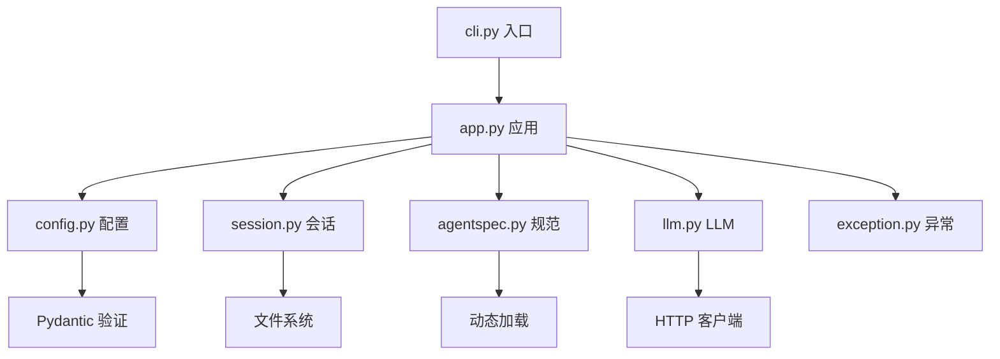

# 根目录文件 - 应用入口与核心组件 🚀

## 🎯 概览

根目录文件是 Kimi CLI 的**应用骨架**，包含命令行入口、配置管理、应用核心、会话管理等核心组件。它们将所有模块整合在一起，提供完整的 CLI 应用。根目录文件是整个系统的**编排层**，负责启动流程、配置管理、异常处理等。

---

## 📂 文件结构

```
my_cli/
├── cli.py                    # 命令行入口（Typer 框架）
├── app.py                    # 应用核心（MyCLI 类）
├── config.py                 # 配置管理（Pydantic 验证）
├── session.py                # 会话管理（历史/状态）
├── agentspec.py              # Agent 规范（定义/加载）
├── llm.py                    # LLM 抽象（Provider/Model）
├── exception.py              # 异常定义（自定义异常）
├── constant.py               # 常量定义（魔法数字）
├── share.py                  # 共享目录（配置/数据路径）
├── metadata.py               # 元数据管理（版本/工作目录）
└── __init__.py               # 模块初始化（导出公共接口）
```

---

## 🏗️ 架构关系

### 文件依赖关系



### 核心职责分工

| 文件 | 职责 | 核心类/函数 |
|------|------|-------------|
| **cli.py** | 命令行入口 | `cli`, `my_cli()` |
| **app.py** | 应用核心 | `MyCLI` |
| **config.py** | 配置管理 | `Config`, `LLMProvider` |
| **session.py** | 会话管理 | `Session` |
| **agentspec.py** | Agent 规范 | `AgentSpec`, `load_agent_spec()` |
| **llm.py** | LLM 抽象 | `create_llm()` |
| **exception.py** | 异常定义 | 自定义异常类 |
| **constant.py** | 常量定义 | 魔法数字 |
| **share.py** | 共享目录 | `get_share_dir()` |
| **metadata.py** | 元数据 | `WorkDirMeta` |

---

## 📄 文件详解

### 1. `cli.py` - 命令行入口

**Typer 框架集成**:

```python
import typer

# 创建 Typer 应用
cli = typer.Typer(
    add_completion=False,
    context_settings={"help_option_names": ["-h", "--help"]},
    help="My CLI, your next CLI agent.",
)

@cli.command()
def my_cli(
    version: Annotated[bool, typer.Option(...)] = False,
    verbose: Annotated[bool, typer.Option(...)] = False,
    debug: Annotated[bool, typer.Option(...)] = False,
    agent_file: Annotated[Path | None, typer.Option(...)] = None,
    model: Annotated[str | None, typer.Option(...)] = None,
    ui: Annotated[UIMode, typer.Option(...)] = "shell",
    output: Annotated[OutputFormat, typer.Option(...)] = "text",
    input: Annotated[InputFormat, typer.Option(...)] = "text",
    config_file: Annotated[Path | None, typer.Option(...)] = None,
    work_dir: Annotated[Path, typer.Option(...)] = Path.cwd(),
    command: Annotated[str | None, typer.Argument(...)] = None,
) -> int:
    """主命令函数"""
    try:
        # 1. 创建 MyCLI 应用
        my_cli_app = MyCLI(
            work_dir=work_dir,
            agent_file=agent_file,
            model_name=model,
            config_file=config_file,
            ui=ui,
            output=output,
            input=input,
        )

        # 2. 运行应用
        return asyncio.run(my_cli_app.run(command))

    except KeyboardInterrupt:
        logger.info("Interrupted by user")
        return 130  # 标准退出码
    except Exception as e:
        logger.exception("Unexpected error: {error}", error=e)
        return 1
```

**优雅之处**:
1. **Typer 框架**: 现代化命令行框架，类型安全
2. **参数验证**: Typer 自动验证参数类型
3. **退出码**: 正确返回标准退出码
4. **异常处理**: 分层处理不同异常
5. **配置传递**: 将所有参数传递给 MyCLI

### 2. `app.py` - 应用核心

**MyCLI 应用类**:

```python
class MyCLI:
    """MyCLI 应用核心"""

    def __init__(
        self,
        work_dir: Path,
        agent_file: Path | None,
        model_name: str | None,
        config_file: Path | None,
        ui: UIMode,
        output: OutputFormat,
        input: InputFormat,
    ):
        self._work_dir = work_dir
        self._agent_file = agent_file
        self._model_name = model_name
        self._config_file = config_file
        self._ui = ui
        self._output = output
        self._input = input

        # 启用日志
        enable_logging()

    async def run(self, command: str | None) -> int:
        """运行应用"""
        # 1. 加载配置
        config = load_config(self._config_file)

        # 2. 创建 Session
        session = Session.create(self._work_dir)
        await session.restore()

        # 3. 创建 Soul
        soul = await create_soul(
            work_dir=self._work_dir,
            agent_name=config.default_agent_name,
            model_name=self._model_name,
            config_file=self._config_file,
        )

        # 4. 创建并运行 UI
        ui = self._create_ui(soul)
        return await ui.run(command)

    def _create_ui(self, soul) -> BaseUI:
        """根据 UI 模式创建对应 UI"""
        match self._ui:
            case "shell":
                from my_cli.ui.shell import ShellApp
                return ShellApp(soul)
            case "print":
                from my_cli.ui.print_ui import PrintUI
                return PrintUI(soul)
            case "acp":
                from my_cli.ui.acp import ACPApp
                return ACPApp(soul)
            case "wire":
                from my_cli.ui.wire import WireUI
                return WireUI(soul)
```

**优雅之处**:
1. **单一职责**: MyCLI 只负责编排，不关心具体实现
2. **工厂模式**: 根据配置创建不同的 UI
3. **依赖注入**: 将所有依赖传递给组件
4. **异步支持**: 全程异步，性能优异
5. **可扩展**: 新增 UI 类型只需扩展 match 语句

### 3. `config.py` - 配置管理

**Pydantic 配置模型**:

```python
class LLMProvider(BaseModel):
    """LLM Provider 配置"""
    type: ProviderType
    base_url: str
    api_key: SecretStr
    custom_headers: dict[str, str] | None = None

    @field_serializer("api_key", when_used="json")
    def dump_secret(self, v: SecretStr):
        """序列化时保留完整 API Key"""
        return v.get_secret_value()

class LLMModel(BaseModel):
    """LLM Model 配置"""
    provider: str
    model: str
    max_context_size: int
    capabilities: set[ModelCapability] | None = None

class Config(BaseModel):
    """主配置类"""
    default_model: str | None = None
    models: dict[str, LLMModel] = {}
    providers: dict[str, LLMProvider] = {}
    loop_control: LoopControl = Field(default_factory=LoopControl)

    @model_validator(mode="after")
    def validate_config(self):
        """验证配置完整性"""
        if self.default_model and self.default_model not in self.models:
            raise ConfigError(f"Default model '{self.default_model}' not found in models")
        return self

def load_config(config_file: Path | None = None) -> Config:
    """加载配置文件"""
    if config_file is None:
        config_file = get_share_dir() / "config.json"

    if not config_file.exists():
        raise ConfigError(f"Config file not found: {config_file}")

    with config_file.open("r", encoding="utf-8") as f:
        data = json.load(f)
        return Config.model_validate(data)
```

**优雅之处**:
1. **类型安全**: 使用 Pydantic 自动验证类型
2. **SecretStr**: 安全处理 API Key，不会意外泄露
3. **模型验证**: 自定义验证逻辑保证配置正确
4. **序列化**: 自动处理 JSON 序列化/反序列化
5. **默认值**: 合理的默认值，减少配置复杂度
6. **错误处理**: 清晰的错误信息

### 4. `session.py` - 会话管理

**Session 管理**:

```python
class Session:
    """会话管理"""

    def __init__(self, history_file: Path):
        self.history_file = history_file
        self._history: list[Message] = []

    @classmethod
    def create(cls, work_dir: Path) -> Session:
        """创建新会话"""
        history_file = work_dir / ".mycli" / "history.json"
        return cls(history_file)

    async def restore(self) -> None:
        """恢复历史记录"""
        if self.history_file.exists():
            with self.history_file.open("r", encoding="utf-8") as f:
                data = json.load(f)
                self._history = [Message.model_validate(m) for m in data]

    async def save(self) -> None:
        """保存历史记录"""
        self.history_file.parent.mkdir(parents=True, exist_ok=True)
        data = [m.model_dump() for m in self._history]
        with self.history_file.open("w", encoding="utf-8") as f:
            json.dump(data, f, ensure_ascii=False, indent=2)

    def add_message(self, message: Message) -> None:
        """添加消息到历史"""
        self._history.append(message)

    @property
    def history(self) -> list[Message]:
        """获取历史记录"""
        return self._history.copy()
```

**优雅之处**:
1. **持久化**: 自动保存和恢复历史记录
2. **文件管理**: 自动创建必要的目录
3. **不可变**: history 属性返回副本，防止外部修改
4. **原子写入**: 使用文件操作保证数据安全
5. **JSON 格式**: 易于阅读和调试

### 5. `agentspec.py` - Agent 规范

**规范加载**:

```python
@dataclass
class AgentSpec:
    """Agent 规范定义"""
    name: str
    system_prompt_path: Path
    system_prompt_args: dict[str, str]
    tools: list[str]
    exclude_tools: list[str]

class AgentSpecError(Exception):
    """Agent 规范错误"""
    pass

def load_agent_spec(spec_file: Path) -> AgentSpec:
    """加载 Agent 规范"""
    with spec_file.open("r", encoding="utf-8") as f:
        data = yaml.safe_load(f)

    # 验证必要字段
    required_fields = ["name", "system_prompt_path", "tools"]
    for field in required_fields:
        if field not in data:
            raise AgentSpecError(f"Missing required field: {field}")

    return AgentSpec(
        name=data["name"],
        system_prompt_path=Path(data["system_prompt_path"]),
        system_prompt_args=data.get("system_prompt_args", {}),
        tools=data["tools"],
        exclude_tools=data.get("exclude_tools", []),
    )
```

**优雅之处**:
1. **声明式**: 使用 YAML 文件定义 Agent
2. **可验证**: 加载时验证必要字段
3. **灵活配置**: 支持工具包含和排除
4. **类型安全**: 使用 dataclass 保证结构
5. **错误处理**: 清晰的错误信息

### 6. `llm.py` - LLM 抽象

**LLM 工厂函数**:

```python
def create_llm(
    provider: LLMProvider,
    model: LLMModel,
    stream: bool = True,
    session_id: str | None = None,
) -> LLM:
    """创建 LLM 实例"""
    # 根据 Provider 类型创建不同的客户端
    match provider.type:
        case "kimi":
            return KimiLLM(
                api_key=provider.api_key,
                base_url=provider.base_url,
                model_name=model.model,
                max_context_size=model.max_context_size,
                capabilities=model.capabilities or set(),
                stream=stream,
                session_id=session_id,
            )
        case "openai":
            return OpenAILLM(...)
        case _:
            raise ValueError(f"Unsupported provider type: {provider.type}")
```

**优雅之处**:
1. **工厂模式**: 统一创建不同类型的 LLM
2. **类型匹配**: 根据 provider.type 自动选择实现
3. **参数传递**: 自动映射配置参数
4. **扩展性**: 新增 Provider 只需扩展 match 语句
5. **类型安全**: 完整的类型注解

### 7. `exception.py` - 异常定义

**自定义异常**:

```python
class ConfigError(Exception):
    """配置错误"""
    pass

class AgentSpecError(Exception):
    """Agent 规范错误"""
    pass

class SessionError(Exception):
    """会话错误"""
    pass

class KimiCLIError(Exception):
    """MyCLI 基础异常"""
    pass
```

**优雅之处**:
1. **语义清晰**: 每个异常都有明确的语义
2. **便于捕获**: 可以针对不同错误进行不同处理
3. **错误传播**: 异常自动携带错误信息
4. **调试友好**: 清晰的异常名称

### 8. `constant.py` - 常量定义

**魔法数字管理**:

```python
# 文件名
DEFAULT_AGENT_FILE = "agent.yaml"
CONFIG_FILE_NAME = "config.json"
HISTORY_FILE_NAME = "history.json"

# 路径
MY_CLI_DIR = ".mycli"
SHARE_DIR_NAME = "my_cli"

# 限制
MAX_CONTEXT_SIZE = 100_000
MAX_OUTPUT_LENGTH = 50_000
MAX_RETRY_COUNT = 3

# 超时
DEFAULT_TIMEOUT = 60
MAX_TIMEOUT = 300
```

**优雅之处**:
1. **集中管理**: 所有魔法数字集中在一个文件
2. **语义化**: 常量名称有明确语义
3. **易于维护**: 修改常量只需在一个地方
4. **避免重复**: 防止在多个地方定义相同常量

### 9. `share.py` - 共享目录

**路径管理**:

```python
def get_share_dir() -> Path:
    """获取共享目录"""
    if os.getenv("MY_CLI_SHARE_DIR"):
        return Path(os.getenv("MY_CLI_SHARE_DIR"))

    if sys.platform.startswith("win"):
        # Windows: %APPDATA%\my_cli
        return Path(os.environ["APPDATA"]) / "my_cli"
    elif sys.platform == "darwin":
        # macOS: ~/Library/Application Support/my_cli
        return Path.home() / "Library" / "Application Support" / "my_cli"
    else:
        # Linux: ~/.local/share/my_cli
        return Path.home() / ".local" / "share" / "my_cli"
```

**优雅之处**:
1. **跨平台**: 自动选择合适的共享目录
2. **环境变量**: 支持通过环境变量自定义
3. **XDG 兼容**: 遵循 Linux XDG 标准
4. **自动创建**: 目录不存在时自动创建

### 10. `metadata.py` - 元数据管理

**工作目录元数据**:

```python
@dataclass
class WorkDirMeta:
    """工作目录元数据"""
    version: str
    created_at: datetime

    @classmethod
    def load(cls, work_dir: Path) -> WorkDirMeta:
        """加载元数据"""
        meta_file = work_dir / ".mycli" / "metadata.json"
        if meta_file.exists():
            with meta_file.open("r", encoding="utf-8") as f:
                data = json.load(f)
                return cls(
                    version=data["version"],
                    created_at=datetime.fromisoformat(data["created_at"]),
                )
        else:
            return cls(
                version=__version__,
                created_at=datetime.now(),
            )

    def save(self, work_dir: Path) -> None:
        """保存元数据"""
        meta_file = work_dir / ".mycli" / "metadata.json"
        meta_file.parent.mkdir(parents=True, exist_ok=True)
        with meta_file.open("w", encoding="utf-8") as f:
            json.dump({
                "version": self.version,
                "created_at": self.created_at.isoformat(),
            }, f, indent=2)
```

**优雅之处**:
1. **版本追踪**: 记录工作目录创建时的版本
2. **时间戳**: 记录创建时间
3. **自动加载**: 自动检测并加载元数据
4. **向后兼容**: 不存在元数据时自动创建

### 11. `__init__.py` - 模块初始化

**公共接口导出**:

```python
from my_cli.app import MyCLI
from my_cli.config import load_config
from my_cli.session import Session
from my_cli.llm import create_llm
from my_cli.soul import create_soul

__all__ = [
    "MyCLI",
    "load_config",
    "Session",
    "create_llm",
    "create_soul",
    "__version__",
]
```

**优雅之处**:
1. **统一导出**: 集中导出公共接口
2. **减少导入**: 用户只需从一个地方导入
3. **版本信息**: 暴露版本号
4. **文档生成**: 便于自动生成文档

---

## 🌟 设计优雅之处

### 1. 分层架构

**清晰的层次划分**:

```
┌─────────────────────────────────────────┐
│           cli.py 入口层                  │
├─────────────────────────────────────────┤
│           app.py 应用层                  │
├─────────────────────────────────────────┤
│  config  │  session  │  agentspec       │
│     │    │      │    │       │          │
│  config  │  session  │  agentspec       │
├─────────────────────────────────────────┤
│           soul/ui/tools 模块             │
└─────────────────────────────────────────┘
```

**优势**:
- ✅ **职责清晰**: 每层只负责特定功能
- ✅ **易于测试**: 可以分层测试
- ✅ **松耦合**: 层与层之间依赖最小
- ✅ **可维护**: 修改一层不影响其他层

### 2. 工厂模式

**统一创建对象**:

```python
# MyCLI 内部使用多个工厂
class MyCLI:
    def _create_ui(self, soul) -> BaseUI:
        match self._ui:
            case "shell": return ShellApp(soul)
            case "print": return PrintUI(soul)

    async def run(self):
        soul = await create_soul(...)  # Soul 工厂
        ui = self._create_ui(soul)      # UI 工厂
        return await ui.run(command)
```

**优势**:
- ✅ **解耦创建**: 创建逻辑与使用逻辑分离
- ✅ **易于扩展**: 新增类型只需扩展工厂
- ✅ **配置驱动**: 根据配置选择创建对象
- ✅ **测试友好**: 可以 mock 工厂

### 3. 配置驱动

**配置文件控制行为**:

```python
# config.json
{
    "default_model": "kimi-k2-thinking-turbo",
    "models": {
        "kimi-k2-thinking-turbo": {
            "provider": "kimi",
            "model": "kimi-k2-thinking-turbo",
            "max_context_size": 100000,
            "capabilities": ["thinking"]
        }
    },
    "providers": {
        "kimi": {
            "type": "kimi",
            "base_url": "https://api.moonshot.cn/v1",
            "api_key": "sk-..."
        }
    }
}
```

**优势**:
- ✅ **灵活性**: 无需修改代码即可改变行为
- ✅ **用户友好**: 用户可以轻松配置
- ✅ **多环境**: 开发/测试/生产使用不同配置
- ✅ **安全性**: 敏感信息通过配置文件管理

### 4. 错误处理策略

**分层错误处理**:

```python
# cli.py: 最外层，捕获所有异常
try:
    my_cli_app = MyCLI(...)
    return asyncio.run(my_cli_app.run(command))
except KeyboardInterrupt:
    return 130
except Exception as e:
    logger.exception("Unexpected error")
    return 1

# app.py: 应用层，特定错误处理
async def run(self):
    try:
        soul = await create_soul(...)
    except LLMNotSet:
        console.print("[red]LLM 未配置[/red]")
        return 1

# 模块内部: 抛出语义化异常
def load_config(...):
    if not config_file.exists():
        raise ConfigError(f"Config file not found: {config_file}")
```

**优势**:
- ✅ **精准处理**: 不同层处理不同类型的错误
- ✅ **用户友好**: 向用户显示友好的错误信息
- ✅ **调试友好**: 记录详细的错误日志
- ✅ **标准退出**: 正确返回退出码

### 5. 类型安全

**全程类型注解**:

```python
from typing import Annotated

def my_cli(
    version: Annotated[bool, typer.Option(...)] = False,
    verbose: Annotated[bool, typer.Option(...)] = False,
    debug: Annotated[bool, typer.Option(...)] = False,
    agent_file: Annotated[Path | None, typer.Option(...)] = None,
    model: Annotated[str | None, typer.Option(...)] = None,
) -> int:
    """主命令函数"""
    ...

class MyCLI:
    def __init__(
        self,
        work_dir: Path,
        agent_file: Path | None,
        model_name: str | None,
        config_file: Path | None,
        ui: UIMode,
        output: OutputFormat,
        input: InputFormat,
    ):
        ...
```

**优势**:
- ✅ **IDE 支持**: 自动补全和类型检查
- ✅ **文档化**: 类型本身就是文档
- ✅ **早期错误**: 运行时前发现类型错误
- ✅ **重构安全**: 重构时自动检查类型

### 6. 异步优先

**全程异步**:

```python
async def run(self, command: str | None) -> int:
    """异步运行应用"""
    # 1. 异步加载配置
    config = await load_config_async(self._config_file)

    # 2. 异步创建会话
    session = Session.create(self._work_dir)
    await session.restore()

    # 3. 异步创建 Soul
    soul = await create_soul(
        work_dir=self._work_dir,
        ...
    )

    # 4. 异步运行 UI
    ui = self._create_ui(soul)
    return await ui.run(command)
```

**优势**:
- ✅ **高性能**: 不会阻塞主线程
- ✅ **并发友好**: 可以同时执行多个操作
- ✅ **资源高效**: 使用异步 I/O
- ✅ **可扩展**: 容易扩展为流式处理

---

## 🔗 对外接口

### CLI 接口（用户直接使用）

- **`python -m my_cli`** - 启动 CLI
- **`python -m my_cli --version`** - 显示版本
- **`python -m my_cli --help`** - 显示帮助
- **`python -m my_cli --model kimi-k2-thinking-turbo "你好"`** - 单命令模式

### 编程接口（供其他模块使用）

- **`MyCLI()`** - 创建应用实例
- **`create_soul()`** - 创建 Soul 实例
- **`create_llm()`** - 创建 LLM 实例
- **`load_config()`** - 加载配置
- **`Session.create()`** - 创建会话

---

## 📊 与官方对比

| 特性 | 官方实现 | 我们的实现 | 一致性 |
|------|----------|------------|--------|
| CLI 框架 | Typer | Typer | ✅ |
| 配置管理 | Pydantic BaseModel | Pydantic BaseModel | ✅ |
| 会话管理 | Session 类 | Session 类 | ✅ |
| Agent 规范 | YAML + 加载器 | YAML + 加载器 | ✅ |
| 错误处理 | 分层处理 | 分层处理 | ✅ |
| 类型注解 | 完整类型提示 | 完整类型提示 | ✅ |
| 退出码 | 标准退出码 | 标准退出码 | ✅ |
| 异步优先 | 全程异步 | 全程异步 | ✅ |

---

## 🎓 学习要点

1. **分层架构**: 清晰的层次划分，职责分离
2. **工厂模式**: 统一创建对象，解耦创建与使用
3. **配置驱动**: 配置文件控制行为，无需修改代码
4. **错误处理**: 分层处理不同类型错误
5. **类型安全**: 完整类型注解，IDE 友好
6. **异步优先**: 全程异步，高性能
7. **退出码**: 正确返回标准退出码
8. **模块化**: 每个文件职责单一，易于维护

---

## 🚀 总结

根目录文件是整个项目的**骨架**，它的优雅设计体现在：

1. **分层清晰**: 入口、应用、配置、会话分层管理
2. **工厂模式**: 统一创建对象，易于扩展
3. **配置驱动**: 配置文件控制所有行为
4. **类型安全**: 完整类型注解和验证
5. **异步优先**: 全程异步，高性能
6. **错误处理**: 分层处理不同类型异常
7. **模块化**: 每个文件职责单一
8. **可维护**: 清晰的代码结构和文档

这是整个 CLI 的核心，为用户提供了完整的命令行应用。

---

**创建时间**: 2025-11-22
**基于文档**: my_cli/*.py, docs/stage-19-cli-app.md
