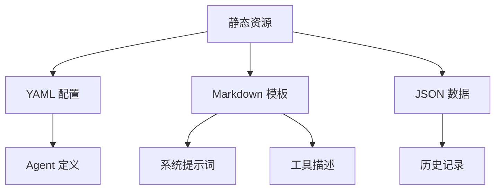

# 静态资源目录 - 配置与提示词库 📚

## 🎯 概览

静态资源目录是 Kimi CLI 的**配置与提示词库**，包含 Agent 规范、提示词模板、系统配置文件等非代码资源。这些目录采用**声明式配置**设计，通过 YAML 配置文件定义 Agent 行为，通过 Markdown 文件存储提示词模板，实现内容与代码的完全分离。这种设计提供了极大的灵活性，用户无需修改代码即可定制 Agent 行为。

---

## 📂 目录结构

```
my_cli/
├── agents/                    # Agent 规范配置
│   └── default/
│       ├── agent.yaml         # 默认 Agent 定义
│       └── system.md          # 系统提示词模板
├── prompts/                   # 提示词模板库
│   ├── __init__.py            # 模板加载器
│   └── compact.md             # Context 压缩提示词
└── deps/                      # 依赖目录（预留）
```

---

## 🏗️ 设计理念

### 内容与代码分离



### 核心优势

| 优势 | 说明 | 价值 |
|------|------|------|
| **声明式** | 使用配置文件定义行为 | 无需编程知识 |
| **版本控制** | 配置文件可版本化 | 追踪变更历史 |
| **多环境** | 不同环境使用不同配置 | 开发/测试/生产 |
| **用户友好** | 人类可读的格式 | 易于理解和修改 |
| **动态加载** | 运行时加载配置文件 | 运行时定制行为 |

---

## 📄 目录详解

### 1. `agents/default/` - Agent 规范

**agent.yaml - Agent 定义**:

```yaml
version: 1
agent:
  name: "MyCLI Assistant"
  system_prompt_path: ./system.md
  system_prompt_args:
    ROLE_ADDITIONAL: ""
  tools:
    # 文件操作工具
    - "my_cli.tools.file:ReadFile"
    - "my_cli.tools.file:WriteFile"
    - "my_cli.tools.file:Glob"
    - "my_cli.tools.file:Grep"
    - "my_cli.tools.file:StrReplaceFile"
    - "my_cli.tools.file:PatchFile"
    # 命令行工具
    - "my_cli.tools.bash:Bash"
    # 网络工具
    - "my_cli.tools.web:SearchWeb"
    - "my_cli.tools.web:FetchURL"
    # 高级工具
    - "my_cli.tools.task:Task"
    - "my_cli.tools.todo:SetTodoList"
    - "my_cli.tools.think:Think"
    # - "my_cli.tools.dmail:SendDMail"  # 时间旅行功能，暂不启用
```

**优雅之处**:
1. **结构化定义**: 使用 YAML 清晰定义 Agent 配置
2. **工具列表**: 明确列出所有可用工具
3. **可扩展**: 可以轻松添加或移除工具
4. **注释友好**: 注释说明每个工具的用途
5. **禁用机制**: 通过注释禁用特定功能

**system.md - 系统提示词**:

```markdown
# MyCLI Assistant

You are MyCLI, an AI assistant that can help users with various tasks.

## Your Capabilities

You have access to a variety of tools that allow you to:

- **File Operations**: Read, write, search, and manipulate files
- **Command Execution**: Run bash commands
- **Web Search**: Search the internet and fetch web pages
- **Task Management**: Create and manage task lists
- **Thinking**: Take time to think through complex problems

## Guidelines

1. **Be helpful**: Always try to provide useful and accurate information.
2. **Be concise**: Keep your responses clear and to the point.
3. **Use tools**: When appropriate, use the available tools to complete tasks.
4. **Ask for clarification**: If you're unsure, ask the user for more information.
...
```

**优雅之处**:
1. **Markdown 格式**: 人类可读，易于编辑
2. **结构清晰**: 使用标题和列表组织内容
3. **文档完整**: 详细说明能力和指南
4. **可国际化**: 文本内容易于翻译
5. **版本控制**: Git 可以跟踪变更历史

### 2. `prompts/` - 提示词模板库

**__init__.py - 模板加载器**:

```python
from pathlib import Path

COMPACT = (Path(__file__).parent / "compact.md").read_text(encoding="utf-8")
```

**优雅之处**:
1. **简单加载**: 直接读取文件内容
2. **集中导出**: 将所有模板集中导出
3. **路径安全**: 使用 `Path(__file__)` 获取正确路径
4. **UTF-8 支持**: 正确处理编码

**compact.md - Context 压缩提示词**:

```markdown
# Context Compression Prompt

You are an AI assistant tasked with compressing a conversation context while preserving the most important information.

Given a conversation history, you need to:

1. **Identify Key Information**:
   - User's original request
   - Important decisions made
   - Critical information learned
   - Actions taken

2. **Remove Redundant Information**:
   - Duplicate questions and answers
   - Unnecessary details
   - Intermediate reasoning steps

3. **Summarize Effectively**:
   - Keep the context concise
   - Preserve important facts
   - Maintain logical flow

4. **Output Format**:
   - Use clear, concise language
   - Organize information logically
   - Include only essential details

Please compress the following conversation context...
```

**优雅之处**:
1. **任务说明**: 详细说明压缩任务的要求
2. **步骤清晰**: 分步骤说明处理流程
3. **格式规范**: 指定输出格式要求
4. **上下文丰富**: 提供足够的信息供 LLM 理解
5. **模块化**: 独立的提示词，易于维护

### 3. `deps/` - 依赖目录（预留）

**当前状态**: 空目录

**设计意图**:
- 用于未来存储外部依赖
- 可以存放第三方库或配置
- 为未来扩展预留空间

**优雅之处**:
1. **结构预留**: 为未来功能预留目录结构
2. **不强制**: 不强制使用，保持灵活性
3. **易于理解**: 目录名清晰表明用途

---

## 🌟 设计优雅之处

### 1. 声明式配置

**YAML 配置文件**:

```yaml
agent:
  name: "MyCLI Assistant"
  system_prompt_path: ./system.md
  tools:
    - "my_cli.tools.file:ReadFile"
    - "my_cli.tools.bash:Bash"
```

**优势**:
- ✅ **人类可读**: YAML 格式清晰易懂
- ✅ **结构化**: 层次分明的数据结构
- ✅ **易于编辑**: 可以使用任何文本编辑器
- ✅ **版本控制**: Git 完美跟踪变更
- ✅ **无代码**: 不需要编程知识

### 2. 模板与内容分离

**Markdown 模板**:

```markdown
# System Prompt

You are an AI assistant that can help users with various tasks.

## Your Capabilities

You have access to a variety of tools...
```

**优势**:
- ✅ **内容分离**: 提示词与代码完全分离
- ✅ **易于维护**: 修改提示词无需修改代码
- ✅ **国际化友好**: 文本内容易于翻译
- ✅ **版本控制**: 跟踪提示词变更历史
- ✅ **协作友好**: 非开发者可以编辑提示词

### 3. 运行时动态加载

**加载流程**:

```python
# 1. 读取 YAML 配置
with open("agent.yaml") as f:
    config = yaml.safe_load(f)

# 2. 加载系统提示词
system_prompt = Path(config["system_prompt_path"]).read_text()

# 3. 动态加载工具
for tool_path in config["tools"]:
    module_name, class_name = tool_path.rsplit(":", 1)
    module = importlib.import_module(module_name)
    tool_class = getattr(module, class_name)
    toolset += tool_class()
```

**优势**:
- ✅ **动态配置**: 运行时加载不同配置
- ✅ **多 Agent**: 支持多个 Agent 配置文件
- ✅ **热更新**: 无需重启即可更新配置
- ✅ **安全加载**: 验证配置正确性

### 4. 模块化组织

**目录结构**:

```
agents/
├── default/
│   ├── agent.yaml
│   └── system.md
├── developer/
│   ├── agent.yaml
│   └── system.md
└── researcher/
    ├── agent.yaml
    └── system.md
```

**优势**:
- ✅ **多角色**: 为不同角色创建不同 Agent
- ✅ **易于管理**: 每个 Agent 有独立的目录
- ✅ **可复用**: 可以在不同项目中复用
- ✅ **清晰命名**: 目录名清晰表明用途

### 5. 注释和文档

**带注释的配置**:

```yaml
tools:
    # 文件操作工具
    - "my_cli.tools.file:ReadFile"
    - "my_cli.tools.file:WriteFile"
    # 命令行工具
    - "my_cli.tools.bash:Bash"
    # - "my_cli.tools.dmail:SendDMail"  # 时间旅行功能，暂不启用
```

**优势**:
- ✅ **自文档化**: 配置本身就是文档
- ✅ **禁用机制**: 通过注释禁用功能
- ✅ **分组清晰**: 注释将工具分组
- ✅ **易于理解**: 新手可以快速理解配置

---

## 🔗 对外接口

### 文件接口（被代码加载）

- **`agents/default/agent.yaml`** - 被 `agentspec.py` 加载
- **`agents/default/system.md`** - 被 `agent.py` 读取
- **`prompts/compact.md`** - 被 `compaction.py` 使用

### 配置接口（用户编辑）

- **修改 agent.yaml** - 改变 Agent 行为
- **编辑 system.md** - 修改系统提示词
- **添加新 Agent** - 创建新的目录和配置文件

---

## 📊 与官方对比

| 特性 | 官方实现 | 我们的实现 | 一致性 |
|------|----------|------------|--------|
| Agent 配置 | YAML 格式 | YAML 格式 | ✅ |
| 系统提示词 | Markdown 模板 | Markdown 模板 | ✅ |
| 工具列表 | 声明式列表 | 声明式列表 | ✅ |
| 模板加载 | Path.read_text() | Path.read_text() | ✅ |
| 提示词库 | prompts 模块 | prompts 模块 | ✅ |
| 版本控制 | 支持 | 支持 | ✅ |
| 国际化 | 文本分离 | 文本分离 | ✅ |
| 注释支持 | 完整注释 | 完整注释 | ✅ |

---

## 🎓 学习要点

1. **声明式设计**: 使用配置文件定义行为
2. **内容分离**: 提示词与代码完全分离
3. **动态加载**: 运行时加载配置文件
4. **模块化组织**: 按角色/功能组织配置
5. **版本控制**: 配置文件可以版本化
6. **注释友好**: 配置文件中添加注释
7. **可国际化**: 文本内容易于翻译
8. **无代码定制**: 用户无需编程即可定制

---

## 🚀 总结

静态资源目录是整个项目的**配置与内容库**，它的优雅设计体现在：

1. **声明式**: 使用 YAML/Markdown 声明式配置
2. **内容分离**: 提示词与代码完全分离
3. **动态加载**: 运行时动态加载配置
4. **模块化**: 按角色/功能组织配置
5. **版本控制**: 配置文件可以版本化
6. **注释友好**: 配置本身包含文档
7. **可扩展**: 易于添加新的 Agent 和提示词
8. **用户友好**: 无需编程知识即可定制

这是整个 CLI 的配置与内容基础，为用户提供了极大的灵活性和可定制性。

---

**创建时间**: 2025-11-22
**基于文档**: my_cli/agents/*, my_cli/prompts/*
