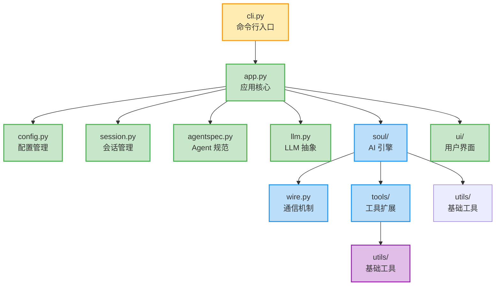
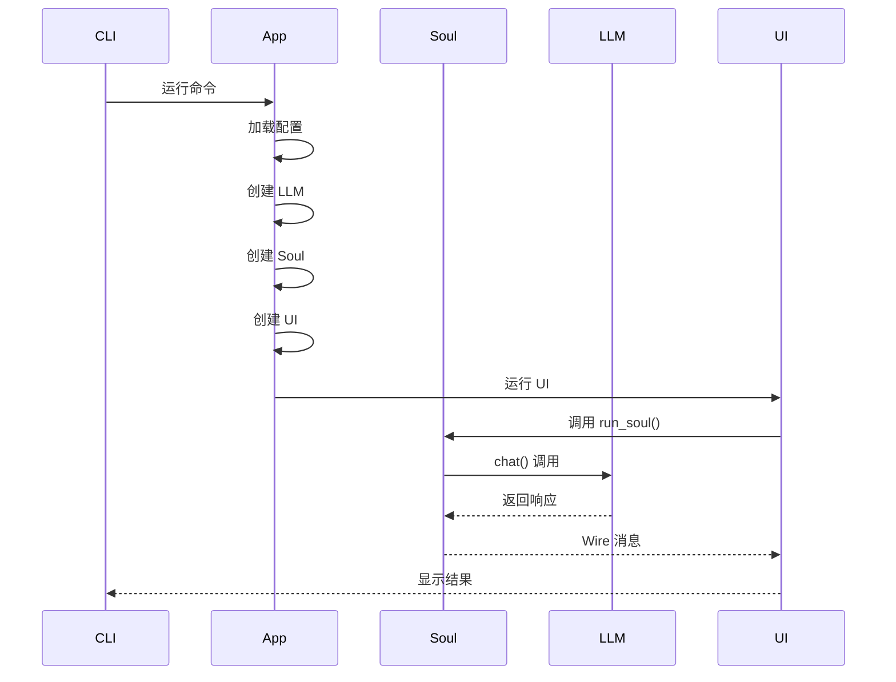
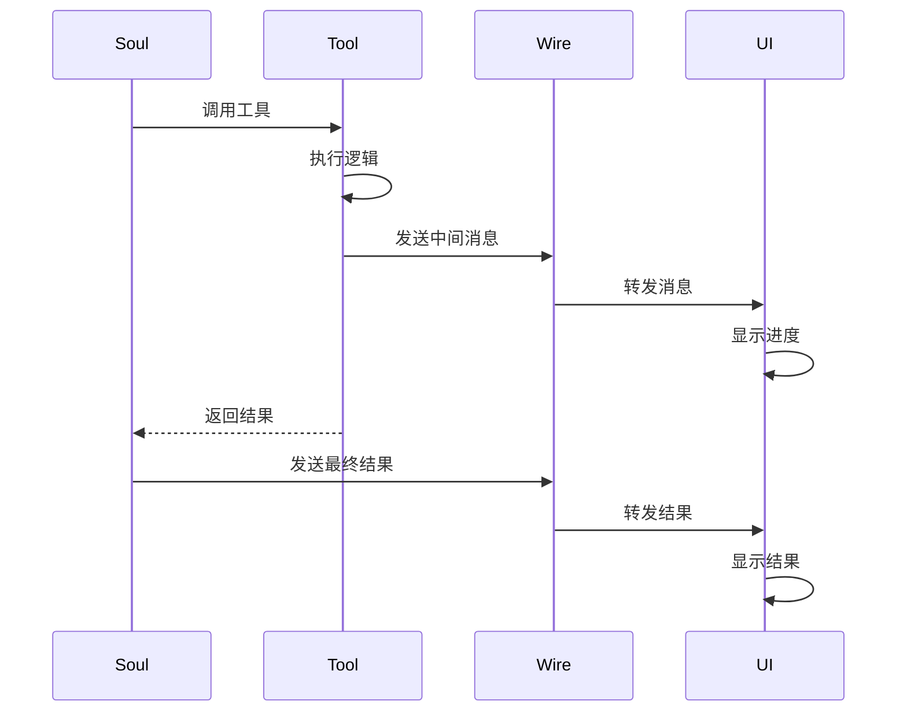

# 模块接口与依赖关系 - 解耦架构的通信桥梁 🌉

## 🎯 文档目的

本文档详细说明 Kimi CLI 中各个模块的**对外接口**、**依赖关系**和**调用模式**。在分模块解耦的设计下，理解模块间如何通过接口协作，是掌握整个系统架构的关键。

---

## 📊 模块依赖关系全景图



---

## 🔌 模块接口详解

### 1. Soul 模块 → 对外暴露接口

**位置**: `my_cli/soul/__init__.py`

#### 对外接口列表

| 接口/函数 | 类型 | 用途 | 调用方 |
|----------|------|------|--------|
| **`run_soul()`** | 函数 | 运行 Agent，连接 UI Loop | UI 层 |
| **`wire_send()`** | 函数 | 发送消息到 Wire | Agent 实现 |
| **`get_wire_or_none()`** | 函数 | 获取当前 Wire | Agent 实现 |
| **`Soul` Protocol** | 协议 | AI Agent 接口定义 | 任何 Agent 实现 |
| **`LLMNotSet`** | 异常 | LLM 未配置错误 | LLM 层 |
| **`LLMNotSupported`** | 异常 | LLM 能力不足 | LLM 层 |
| **`MaxStepsReached`** | 异常 | 步骤数超限 | 任何位置 |
| **`RunCancelled`** | 异常 | 运行被取消 | UI 层 |

#### 典型使用模式

**UI 层调用 Soul**:
```python
# my_cli/ui/shell.py
from my_cli.soul import run_soul, RunCancelled

async def run_shell():
    cancel_event = asyncio.Event()
    try:
        await run_soul(
            soul=self._soul,
            user_input=user_input,
            ui_loop_fn=self._ui_loop,
            cancel_event=cancel_event
        )
    except RunCancelled:
        console.print("[yellow]运行已取消[/yellow]")
```

**Agent 实现使用 Wire**:
```python
# Agent 实现模块
from my_cli.soul import wire_send, get_wire_or_none
from my_cli.soul import StepBegin, StepEnd, ToolResult

class KimiSoul:
    async def _step(self):
        wire_send(StepBegin(n=self._step_no))
        # 执行逻辑...
        wire_send(ToolResult(tool="bash", result="完成"))
        wire_send(StepEnd())
```

**依赖注入依赖**:
```python
# my_cli/llm.py
from my_cli.soul import LLMNotSet, LLMNotSupported

def create_llm(...):
    if not llm_configured:
        raise LLMNotSet("LLM 未配置")
    if not supports_required_caps:
        raise LLMNotSupported(llm, required_caps)
```

---

### 2. UI 模块 → 对外暴露接口

**位置**: `my_cli/ui/`

#### 对外接口列表

| 接口/函数 | 类型 | 用途 | 调用方 |
|----------|------|------|--------|
| **`BaseUI` Protocol** | 协议 | UI 接口定义 | 应用层 |
| **`ShellApp`** | 类 | 交互式 Shell UI | 应用层 |
| **`PrintUI`** | 类 | 简单打印 UI | 应用层 |
| **`ACPApp`** | 类 | IDE 集成 UI | 应用层 |
| **`WireUI`** | 类 | Wire 协议 UI | 应用层 |

#### 典型使用模式

**应用层创建 UI**:
```python
# my_cli/app.py
def _create_ui(self, soul) -> BaseUI:
    match self._ui:
        case "shell":
            from my_cli.ui.shell import ShellApp
            return ShellApp(soul)
        case "print":
            from my_cli.ui.print_ui import PrintUI
            return PrintUI(soul)
        case "acp":
            from my_cli.ui.acp import ACPApp
            return ACPApp(soul)
```

**UI 内部使用 Soul**:
```python
# my_cli/ui/shell.py
class ShellApp(BaseUI):
    def __init__(self, soul: Soul):
        self._soul = soul  # 接收 Soul 实例
        self._console = Console()

    async def run(self, command):
        # 直接调用 Soul 的方法
        await self._soul.run(user_input)
```

---

### 3. LLM 模块 → 对外暴露接口

**位置**: `my_cli/llm.py`

#### 对外接口列表

| 接口/函数 | 类型 | 用途 | 调用方 |
|----------|------|------|--------|
| **`create_llm()`** | 函数 | 创建 LLM 实例 | Soul/应用层 |
| **`LLM` Protocol** | 协议 | LLM 接口定义 | 各种 Provider |
| **`KimiLLM`** | 类 | Kimi Provider 实现 | 内部使用 |
| **`OpenAILLM`** | 类 | OpenAI Provider 实现 | 内部使用 |

#### 典型使用模式

**应用层创建 LLM**:
```python
# my_cli/soul 实现模块
from my_cli.llm import create_llm

async def create_soul(...):
    llm = create_llm(
        provider=config.providers["kimi"],
        model=config.models["kimi-k2"],
        stream=True
    )
    return KimiSoul(llm=llm, ...)
```

**LLM 使用协议**:
```python
# my_cli/llm.py
@runtime_checkable
class LLM(Protocol):
    async def chat(
        self,
        messages: list[Message],
        stream: bool = True,
        **kwargs
    ) -> ChatResult:
        ...

# 具体实现
class KimiLLM:
    async def chat(self, messages, stream=True, **kwargs):
        # 实现具体的 API 调用
        ...
```

---

### 4. Tools 模块 → 对外暴露接口

**位置**: `my_cli/tools/`

#### 对外接口列表

| 接口/函数 | 类型 | 用途 | 调用方 |
|----------|------|------|--------|
| **`CallableTool2` Protocol** | 协议 | 工具接口定义 | 所有工具 |
| **`ToolResult`** | 类 | 工具执行结果 | Soul/工具 |
| **`load_agent()`** | 函数 | 加载 Agent 和工具 | Soul/应用层 |

#### 典型使用模式

**Agent 使用工具**:
```python
# my_cli/soul 实现模块
from my_cli.tools import load_agent

async def create_soul(...):
    # 动态加载工具
    agent = await load_agent(
        agent_file=Path("agent.yaml"),
        runtime=runtime
    )
    return KimiSoul(agent=agent, ...)
```

**工具实现协议**:
```python
# my_cli/tools/file.py
@runtime_checkable
class CallableTool2(Protocol):
    name: str
    description: str
    parameters: dict[str, Any]

    async def __call__(self, **kwargs) -> ToolResult:
        ...

class ReadFile:
    name = "ReadFile"
    description = "读取文件内容"
    parameters = {"path": str}

    async def __call__(self, path: str) -> ToolResult:
        # 实现文件读取
        ...
```

---

### 5. Wire 模块 → 对外暴露接口

**位置**: `my_cli/wire.py`

#### 对外接口列表

| 接口/函数 | 类型 | 用途 | 调用方 |
|----------|------|------|--------|
| **`Wire`** | 类 | 异步消息队列 | Soul/UI |
| **`WireMessage`** | 协议 | 消息基类 | 所有消息 |
| **`WireUISide`** | 类 | UI 端接口 | UI 实现 |
| **`WireSoulSide`** | 类 | Soul 端接口 | Soul 实现 |

#### 典型使用模式

**Soul 发送消息**:
```python
# my_cli/soul/__init__.py
from my_cli.wire import wire_send

def wire_send(msg: WireMessage) -> None:
    wire = get_wire_or_none()
    assert wire is not None
    wire.soul_side.send(msg)

# 使用
wire_send(StepBegin(n=1))
wire_send(Message(content="Hello"))
```

**UI 接收消息**:
```python
# my_cli/ui/shell.py
async def _ui_loop(ui_side: WireUISide):
    async for message in ui_side:
        match message:
            case StepBegin(n):
                console.print(f"[cyan]步骤 {n}[/cyan]")
            case Message(content):
                console.print(content)
```

---

### 6. Config 模块 → 对外暴露接口

**位置**: `my_cli/config.py`

#### 对外接口列表

| 接口/函数 | 类型 | 用途 | 调用方 |
|----------|------|------|--------|
| **`Config`** | 类 | 主配置模型 | 全局 |
| **`LLMProvider`** | 类 | Provider 配置 | LLM/Soul |
| **`LLMModel`** | 类 | Model 配置 | LLM/Soul |
| **`load_config()`** | 函数 | 加载配置文件 | 应用层 |

#### 典型使用模式

**应用层加载配置**:
```python
# my_cli/app.py
from my_cli.config import load_config

async def run(self, command):
    config = load_config(self._config_file)
    llm = create_llm(
        provider=config.providers["kimi"],
        model=config.models["kimi-k2"]
    )
```

---

## 🔄 调用链路分析

### 典型调用链 1: 启动流程



### 典型调用链 2: 工具执行



---

## 📦 跨模块数据流

### 1. 配置传递链

```
Config → LLM → Soul → Tools
  ↓        ↓     ↓      ↓
Provider Model Agent Toolset
```

### 2. 消息传递链

```
Soul → Wire → UI → 用户
  ↓      ↓    ↓
工具结果 消息  显示
```

### 3. 状态传递链

```
Session → Context → Soul → UI
   ↓         ↓       ↓     ↓
历史记录   上下文   状态   状态栏
```

---

## 🎯 设计模式应用

### 1. Protocol 模式

**使用位置**: Soul、LLM、Tools、UI

**优势**:
- ✅ 解耦接口和实现
- ✅ 鸭子类型支持
- ✅ 运行时类型检查

**示例**:
```python
# 任何实现了 Soul Protocol 的类都可以作为 Agent
class KimiSoul(Soul): ...
class CustomAgent(Soul): ...
```

### 2. 工厂模式

**使用位置**: LLM、Soul、UI

**优势**:
- ✅ 统一创建逻辑
- ✅ 便于扩展
- ✅ 配置驱动

**示例**:
```python
# 统一的创建接口
llm = create_llm(provider, model)
ui = create_ui(mode, soul)
```

### 3. 发布-订阅模式

**使用位置**: Wire 机制

**优势**:
- ✅ 解耦生产者和消费者
- ✅ 异步消息传递
- ✅ 实时更新

**示例**:
```python
# Soul 发布消息
wire_send(Message(content="hello"))

# UI 订阅消息
async for message in ui_side:
    render(message)
```

---

## 🚫 依赖方向原则

### ✅ 正向依赖（推荐）

```
CLI → App → UI/Soul → Tools → Utils
```

### ❌ 反向依赖（避免）

```
Utils → Tools → Soul → UI → App → CLI
```

### 🔄 跨层依赖（谨慎）

- **Wire**: UI ↔ Soul（双向）
- **Config**: 跨所有层（只读）

---

## 📋 模块职责矩阵

| 模块 | 职责 | 依赖 | 被依赖 |
|------|------|------|--------|
| **CLI** | 命令行入口 | App | 无 |
| **App** | 应用编排 | Config/Session/LLM/Soul/UI | CLI |
| **Config** | 配置管理 | 无 | 所有人 |
| **Session** | 会话管理 | 文件系统 | App/Soul |
| **LLM** | 大模型抽象 | Config | Soul |
| **Soul** | AI 引擎 | LLM/Tools/Wire | App/UI |
| **Tools** | 工具扩展 | Utils | Soul |
| **UI** | 用户界面 | Soul/Wire | App |
| **Wire** | 通信机制 | 无 | Soul/UI |
| **Utils** | 基础工具 | 无 | 所有人 |

---

## 🎓 最佳实践

### 1. 接口设计原则

- ✅ **小接口原则**: 每个接口只做一件事
- ✅ **稳定接口**: 接口一旦发布尽量不变
- ✅ **显式依赖**: 明确列出所有依赖
- ✅ **文档友好**: 每个接口都有清晰的文档

### 2. 模块交互原则

- ✅ **单向依赖**: 避免循环依赖
- ✅ **依赖抽象**: 依赖 Protocol 而非具体类
- ✅ **最小耦合**: 只依赖必需的接口
- ✅ **消息传递**: 使用 Wire 进行跨层通信

### 3. 扩展性原则

- ✅ **开放封闭**: 对扩展开放，对修改封闭
- ✅ **插件化**: 新功能以插件形式添加
- ✅ **配置驱动**: 通过配置控制行为
- ✅ **协议优先**: 新模块先定义 Protocol

---

## 🔍 常见调用场景

### 场景 1: 单次对话

```
用户输入 → UI → Soul → LLM → 响应 → UI → 用户
```

### 场景 2: 工具调用

```
用户输入 → Soul → 工具 → 执行 → 结果 → Soul → LLM → 响应
```

### 场景 3: 流式输出

```
LLM → 流数据 → Soul → Wire → UI → 实时显示
```

### 场景 4: 取消操作

```
用户 Ctrl+C → UI → 取消事件 → Soul → 停止执行
```

---

## 📚 总结

模块接口与依赖关系是解耦架构的核心。通过：

1. **明确的接口定义** - Protocol 确保契约稳定
2. **清晰的依赖方向** - 避免循环依赖和紧耦合
3. **统一的消息机制** - Wire 实现跨层通信
4. **合理的层次划分** - 每层职责单一明确

整个系统实现了**高内聚、低耦合**的目标，既保证了代码的可维护性，又提供了强大的可扩展性。

---

**创建时间**: 2025-11-22
**文档目的**: 解释模块间接口和依赖关系
**基于文档**: 所有分模块总结文档
